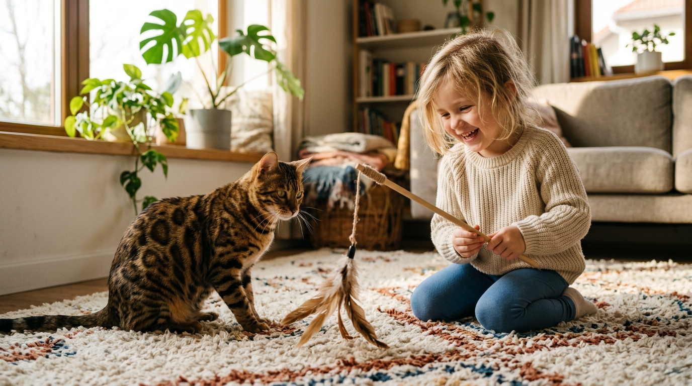

Kot bengalski a dzieci — czy bengal to kot dla rodziny z dziećmi?

Dziki wygląd mini-lamparda i energiczny temperament kota bengalskiego często budzą pytania u rodziców: czy kot bengalski jest bezpieczny dla małych dzieci? Czy sprawdzi się w domu pełnym dziecięcego gwaru?

Odpowiedź brzmi: **Tak, kot bengalski doskonale odnajduje się w rodzinie z dziećmi**, pod warunkiem że pochodzi z odpowiedzialnej, domowej hodowli, w której od pierwszych dni przeszedł pełny proces socjalizacji. Zamiast lęku czy dystansu, prawidłowo wychowany bengal wnosi do domu mnóstwo radości, energii i gotowości do wspólnej zabawy.

*Zrównoważony kot bengalski i dziecko — zabawa zabawką na wędce tworzy bezpieczną i silną więź.*

---

## Jaki naprawdę jest kot bengalski w kontakcie z dziećmi?

Kot bengalski to rasa o wyjątkowej inteligencji i podwyższonym poziomie energii. W przeciwieństwie do kotów o spokojnym charakterze (jak np. ras brytyjskich), bengal nie spędza całego dnia na kanapie — on szuka interakcji i partnera do zabawy.

Dla dzieci w wieku przedszkolnym i szkolnym jest to ogromna zaleta:

- **Niekończąca się ochota na zabawę.** Kot bengalski uwielbia aportować piłeczki, biegać za piórkiem na wędce i pokonywać domowe tory przeszkód.
- **Brak skłonności do agresji.** Prawidłowo socjalizowany bengal przy nieprzyjemnym dla niego bodźcu (np. zbyt głośnym hałasie) nie reaguje pazurami, lecz po prostu odchodzi w swoje bezpieczne miejsce.
- **Niezwykła inteligencja.** Dzieci mogą uczyć kota bengalskiego prostych sztuczek (siad, przybij piątkę, aport), co buduje wspaniałą więź i uczy dziecko odpowiedzialności.

---

## Kluczowa rola socjalizacji w hodowli — dlaczego to od nas zależy sukces?

Relacja kota z dziećmi kształtuje się w pierwszych 12–14 tygodniach jego życia. W [naszej hodowli Kotów z Mazowieckiej Szwajcarii](/o-hodowli) w Sikorzu koło Płocka wychowujemy kocięta w samym sercu naszego domu.

Od momentu otwarcia oczu maluchy mają kontakt z:
- codziennymi odgłosami domowymi (odkurzacz, telewizor, dziecięcy śmiech i kroki),
- delikatnym ludzkim dotykiem i noszeniem na rękach,
- różnorodnymi zabawkami i bodźcami rozwijającymi pewność siebie.

Dzięki temu nasze kocięta trafiają do nowych rodzin bez lęków, gotowe do natychmiastowego nawiązania kontaktu z najmłodszymi domownikami.

*Domowa socjalizacja malucha od pierwszych tygodni gwarantuje pewność siebie i zaufanie do ludzi.*

---

## Złote zasady bezpiecznej relacji dziecka z kotem bengalskim

Aby wspólne życie pod jednym dachem przebiegało harmonijnie, warto od pierwszego dnia wdrożyć kilka prostych zasad:

### 1. Zabawa zawsze zabawką, nigdy dłońmi
Uczymy dziecko od początku, że dłonie służą wyłącznie do głaskania i karmienia. Do zabawy używamy wyłącznie wędki z piórkami, piłeczek czy tuneli. Dzięki temu kot nie traktuje dziecięcych rąk jak "zwierzyny".

### 2. Strefa Azylu — absolutny szwędek kota
Każdy kot potrzebuje miejsca, w którym może odpocząć. Może to być wysoki drapak (min. 120–150 cm) lub legowisko na komodzie. Zasada dla dziecka jest prosta: gdy kot przebywa w swoim azylu lub śpi, nie przeszkadzamy mu.

### 3. Włączenie dziecka w opiekę
Dzieci uwielbiają czuć się dorosłe i odpowiedzialne. Powierzenie dziecku zadania nakładania karmy czy wymiany wody buduje niezwykłą więź emocjonalną ze zwierzęciem.

---

## W jakim wieku powinno być dziecko?

- **Dzieci w wieku 3–12 lat:** To idealni towarzysze dla bengala. Mają energię do wspólnej zabawy i potrafią już zrozumieć zasady szacunku wobec zwierzęcia.
- **Niemowlęta i małe dzieci (0–2 lata):** Kot bengalski doskonale toleruje obecność maluszków, jednak kontakt zawsze powinien odbywać się pod bezpośrednim nadzorem rodzica.

*Kocięta bengalskie z legalnej hodowli SHiOZ uchodzą za wyjątkowo zrównoważone i przyjacielskie.*

---

## Przetestuj relację — odwiedź naszą hodowlę z dziećmi!

Nie musisz podejmować decyzji w ciemno. Zapraszamy rodziny z dziećmi do odwiedzenia naszej hodowli w Sikorzu (powiat płocki, woj. mazowieckie — wygodny dojazd z Warszawy, Łodzi i Torunia).

Podczas wizyty:
1. Zobaczysz, jak nasze kocięta reagują na Twoje dzieci w naturalnym domowym otoczeniu.
2. Porozmawiamy o charakterze poszczególnych maluchów i dobierzemy kocię o idealnym temperamencie dla Twojej rodziny.
3. Dowiesz się więcej o [kosztach zakupu kota bengalskiego](/blog/001-ile-kosztuje-kot-bengalski) oraz o tym, jak przygotować [kompletną wyprawkę dla kociaka](/blog/sztuka-kreowania-domowego-sanktuarium-kompletny-przewodnik-po-wyprawce-premium-dla-kociecia).

---

## 🐾 Dostępne kocięta bengalskie gotowe do pokochania

W naszej hodowli w Sikorzu posiadamy aktualnie **5 cudownych kociąt bengalskich**:

- 🏠 **2 starsze kocięta** — w pełni usamodzielnione, z kompletem szczepień i badań, **gotowe do zamieszkania z Twoją rodziną od zaraz**!
- 🗓️ **3 młodsze kocięta** — kończące proces socjalizacji, **gotowe do odbioru od przyszłego tygodnia**!

Oferujemy bardzo atrakcyjne, konkurencyjne ceny w stosunku do średniej rynkowej, zapewniając bezkompromisową jakość, pełne badania genetyczne parents (HCM, PKD) oraz pełną dokumentację felinologiczną.

👉 **[Zobacz nasze dostępne kocięta bengalskie i skontaktuj się z nami →](/koty)**  
📞 **Telefon / WhatsApp:** +48 789 790 846  
📍 **Lokalizacja:** Sikórz k. Płocka (woj. mazowieckie)
