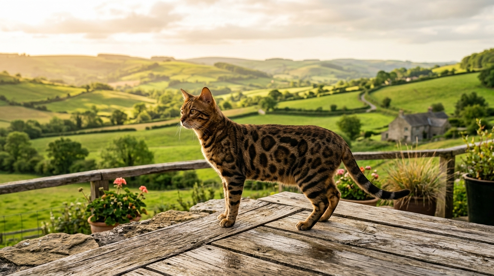

Hodowla kotów bengalskich na Mazowszu — jak wybrać hodowcę, któremu zaufasz

Poszukiwanie idealnego kota bengalskiego na terenie województwa mazowieckiego (w okolicach Warszawy, Płocka, Łodzi czy Ciechanowa) to ekscytujący, ale i odpowiedzialny proces. Dziki, egzotyczny wygląd bengala sprawia, że rasa cieszy się ogromną popularnością — niestety przyciąga to również nieuczciwych sprzedawców i pseudohodowle.

Jak zatem wybrać zarejestrowaną, bezpieczną hodowlę kotów bengalskich na Mazowszu? Odpowiedź brzmi: **Wybierz hodowlę domową, która oferuje pełen rodowód uznanego związku felinologicznego, przeprowadza badania genetyczne rodziców (HCM, PKD) i zaprasza do osobistych odwiedzin przed rezerwacją.**

*Kota bengalskiego warto kupować wyłącznie z certyfikowanej hodowli domowej — w otoczeniu natury i pod stałą opieką weterynaryjną.*

---

## 5 filarów odpowiedzialnej hodowli kotów bengalskich

Zanim wpłacisz zaliczkę lub zarezerwujesz malucha, upewnij się, że wybrany hodowca spełnia 5 kluczowych kryteriów:

### 1. Oficjalna rejestracja felinologiczna
Profesjonalna hodowla musi działać pod patronatem legalnego związku felinologicznego. Nasza **Hodowla Kotów z Mazowieckiej Szwajcarii** działa na podstawie certyfikatu **SHiOZ ZOOLANDIA nr 58/CW/2025 (Numer rejestracyjny: 58/P/2025)**. Dokument ten gwarantuje, że nasze koty posiadają udokumentowane minimum 4-pokoleniowe rodowody bez krzyżowań pokrewnych.

### 2. Obligatoryjne badania genetyczne (HCM i PKD)
Kot bengalski to rasa wymagająca odpowiedzialnej selekcji hodowlanej. Absolutnym standardem powinny być [badania genetyczne HCM i PKD](/blog/niewidzialne-dziedzictwo-dlaczego-badania-genetyczne-hcm-i-pkd-to-najpiekniejsza-obietnica-dla-twojej-rodziny). Echokardiografia serca eliminuje ryzyko dziedziczenia kardiomiopatii przerostowej, a testy nerowe wykluczają wielotorbielowatość nerek.

### 3. Warunki domowe — brak klatek
Kot bengalski rozwija swój wspaniały, zrównoważony charakter tylko wtedy, gdy wychowuje się w sercu domu. Unikaj miejsc, gdzie koty trzymane są w klatkach czy odizolowanych piwnicach. Kocięta wychowywane z ludźmi są śmiałe, ufne i bezpieczne także [w relacji z dziećmi](/blog/002-kot-bengalski-a-dzieci).

### 4. Umowa cywilnoprawna i wyprawka
Legalny hodowca zawsze podpisuje pisemną umowę sprzedaży, która chroni prawa kupującego i dobro zwierzęcia. Maluch opuszcza hodowlę w wieku min. 12–14 tygodni, z kompletem dwóch szczepień, odrobaczeniami, mikrochipem oraz bogatą wyprawką startową.

### 5. Wsparcie po sprzedaży
Odpowiedzialny hodowca nie znika po przekazaniu transakcji. Służy radą w kwestiach żywienia, zdrowia czy adaptacji przez całe życie kota.

*Nasze maluchy dorastają w otoczeniu miłości i domowych bodźców, co buduje ich spokojny temperament.*

---

## Hodowla Kotów z Mazowieckiej Szwajcarii — nasza misja w Sikorzu k. Płocka

Nasza hodowla położona jest w malowniczej miejscowości **Sikórz (powiat płocki, woj. mazowieckie)** — w otulinie przyrodniczej znanej jako Mazowiecka Szwajcaria. To zaledwie godzina jazdy z Płocka, Włocławka czy Ciechanowa oraz wygodny dojazd z Warszawy i Łodzi.

Stawiamy na kameralny charakter hodowli. Nasze koty bengalskie stanowią pełnoprawnych członków rodziny. Mają do dyspozycji przestronne, bezpieczne przestrzenie, bogate środowisko do wspinaczki i codzienny kontakt z człowiekiem.

---

## Dlaczego warto odwiedzić naszą hodowlę osobiście?

Zachęcamy każdego przyszłego opiekuna do wizyty przed rezerwacją:

1. **Poznasz rodziców kociąt** — ocenisz ich budowę, piękny kontrast rozet, lśniące futro i wyjątkowo łagodny charakter.
2. **Zobaczysz warunki życiowe** — przekonasz się na własne oczy, w jak czystym i pełnym miłości środowisku dorastają kocięta.
3. **Sprawdzisz dokumentację** — udostępniamy do wglądu rodowody, certyfikaty wystawowe oraz wyniki badań genetycznych.

*Wizytując hodowlę w Sikorzu, możesz osobiście poznać maluchy i przetestować relację z kotem.*

---

## Ile kosztuje kot bengalski na Mazowszu?

[Średnie ceny rynkowe kotów bengalskich](/blog/001-ile-kosztuje-kot-bengalski) w woj. mazowieckim kształtują się w przedziale **3 000 zł – 5 000 zł** za klasę PET (pupil domowy z rodowodem).

> **Nasza polityka cenowa:**  
> W Hodowli Kotów z Mazowieckiej Szwajcarii oferujemy **ceny nieco niższe i bardziej konkurencyjne niż średnia rynkowa**, nie idąc na żaden kompromis w kwestii zdrowia, żywienia czy badań. Każde kocię wyceniamy indywidualnie.

---

## 🐾 Dostępne kocięta bengalskie na Mazowszu (Aktualna oferta)

Aktualnie w naszej hodowli w Sikorzu posiadamy **5 wyjątkowych kociąt bengalskich**:

- 🏠 **2 starsze kocięta** — w pełni usamodzielnione, z kompletem szczepień i badań, **gotowe do zmiany domu od zaraz**!
- 🗓️ **3 młodsze kocięta** — kończące proces socjalizacji, **gotowe do odbioru od przyszłego tygodnia**!

Zapraszamy do kontaktu, rezerwacji oraz umówienia wizyty w naszej hodowli.

👉 **[Poznaj naszą hodowlę i zobacz dostępne kocięta →](/o-hodowli)**  
📞 **Telefon / WhatsApp:** +48 789 790 846  
📍 **Lokalizacja:** Sikórz (powiat płocki, woj. mazowieckie — blisko Warszawy, Płocka i Łodzi)
