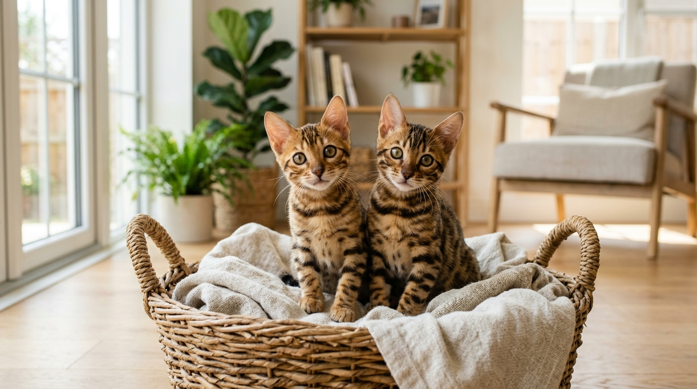

Kocięta bengalskie na sprzedaż — co warto wiedzieć przed rezerwacją

Zakup kota bengalskiego z certyfikowanej hodowli to decyzja na kilkanaście lat. Szukając idealnego malucha w ogłoszeniach "kocięta bengalskie na sprzedaż", warto wiedzieć, jak wygląda bezpieczna rezerwacja, jakie dokumenty powinieneś otrzymać i jak przygotować dom na przyjęcie nowego domownika.

Odpowiedź w pigułce: **Bezpieczny zakup kocięcia bengalskiego wymaga formalnej umowy rezerwacyjnej, udokumentowanego rodowodu uznanego związku felinologicznego (np. SHiOZ ZOOLANDIA), kompletnej profilaktyki weterynaryjnej oraz odbioru malucha dopiero po ukończeniu 12–14 tygodni życia.**

*Zarezerwowanie malucha z odpowiedzialnej hodowli gwarantuje zdrowie genetyczne, rodowód oraz pełną profilaktykę weterynaryjną.*

---

## Kiedy kocię bengalskie jest gotowe do odbioru?

W [naszej Hodowli Kotów z Mazowieckiej Szwajcarii](/o-hodowli) w Sikorzu k. Płocka ściśle przestrzegamy standardów felinologicznych. Kocięta opuszczają dom hodowcy **między 12. a 14. tygodniem życia**.

Dlaczego ten czas jest kluczowy?
- **Pełny cykl odpornościowy:** Kocię otrzymuje dwa kompletne szczepienia przeciwko chorobom zakaźnym oraz dwukrotne odrobaczenie.
- **Domyślna socjalizacja:** Między 8. a 12. tygodniem matka i rodzeństwo uczą malucha hamowania siły gryzienia, chowania pazurków oraz radzenia sobie ze stresem.
- **Samodzielność:** Kocię ma w pełni opanowane korzystanie z kuwety i drapaka oraz samodzielne jedzenie karmy mokrej i surowego mięsa.

---

## Proces rezerwacji kocięcia w naszej hodowli — krok po kroku

Chcemy, aby proces wyboru i rezerwacji malucha był dla Ciebie maksymalnie przejrzysty i komfortowy:

### Krok 1: Wstępny kontakt i wybór kocięcia
Przeglądasz naszą ofertę [dostępnych kociąt bengalskich](/koty). Kontaktujesz się z nami telefonicznie, przez formularz lub WhatsApp. Rozmawiamy o Twoich oczekiwaniach, stylu życia oraz o tym, czy w Twoim domu wychowują się [dzieci](/blog/002-kot-bengalski-a-dzieci) lub inne zwierzęta.

### Krok 2: Osobista wizyta w hodowli w Sikorzu (opcjonalnie)
Serdecznie zapraszamy do odwiedzenia naszej hodowli pod Płockiem (woj. mazowieckie). Możesz poznać maluchy, ich rodziców, ocenić budowę, kontrast maści oraz wyjątkowy temperament rodziców.

### Krok 3: Umowa rezerwacyjna i zadatek
Po wyborze konkretnego kociaka podpisujemy umowę rezerwacyjną. Wpłata zadatku stanowi gwarancję, że maluch jest zarezerwowany wyłącznie dla Ciebie i nie trafi do innej rodziny.

### Krok 4: Odbiór kocięcia
W ustalonym dniu odbioru (po ukończeniu profilaktyki weterynaryjnej) podpisujemy umowę przekazania kota, rozliczamy pozostałą kwotę i wręczamy kompletny pakiet dokumentów oraz wyprawkę.

*Wszystkie maluchy przed przekazaniem do nowego domu przechodzą kontrole weterynaryjne i posiadają mikrochip.*

---

## Co zawiera wyprawka i dokumentacja kocięcia?

Kupując kocię z legalnej hodowli SHiOZ ZOOLANDIA (Certyfikat nr 58/CW/2025), wraz z maluchem otrzymujesz:

1. **Oficjalny Rodowód SHiOZ** — potwierdzający czyste pochodzenie rasy do 4 pokoleń wstecz.
2. **Książeczkę Zdrowia Kota** — z wpisami dwóch szczepień, odrobaczeń i numerem mikrochipa.
3. **Pisemną Umowę KUPNA-SPRZEDAŻY** — zawierającą gwarancje zdrowotne.
4. **Wyprawkę Startową:**
   - Zapas karmy wysokomięsnej na pierwsze dni w nowym domu,
   - Ulubioną zabawkę z zapachem gniazda (ułatwiającą adaptację),
   - Instrukcję żywieniową i pielęgnacyjną,
   - Stałe wsparcie hodowcy po zakupie.

---

## Jak przygotować dom przed przyjazdem kocięcia bengalskiego?

Zanim maluch przekroczy próg Twojego domu, warto zaopatrzyć się w:
- **Drapak:** Najlepiej pionowy, stabilny drapak o wysokości minimum 120 cm.
- **Kuwetę i żwirek:** Taki sam żwirek, jakiego kocię używało w hodowli.
- **Miseczki:** Cerami czne lub ze stali nierdzewnej na wodę i mokrą karmę.
- **Zabawki:** Wędki z piórkami, piłeczki, tunele.

Zadbaj również o zabezpieczenie okien i balkonu siatką ochronną — bengale to skoczne i bardzo ciekawe świata koty.

*Zapewniamy wsparcie żywieniowe i behawioralne dla każdego nowego opiekuna naszych maluchów.*

---

## Ile kosztuje kocię bengalskie i jaka jest nasza oferta?

Więcej o [cenach kotów bengalskich w Polsce](/blog/001-ile-kosztuje-kot-bengalski) przeczytasz w naszym szczegółowym przewodniku. W naszej hodowli oferujemy **atrakcyjniejsze i nieco niższe ceny niż średnia rynkowa**, zachowując najwyższą jakość hodowlaną, pełną profilaktykę i badania parents na HCM i PKD.

---

## 🐾 Aktualnie dostępne kocięta bengalskie na sprzedaż

W hodowli Kotów z Mazowieckiej Szwajcarii (Sikórz k. Płocka / Mazowieckie) posiadamy w tej chwili **5 pięknych kociąt bengalskich**:

- 🏠 **2 starsze kocięta** — w pełni usamodzielnione, z kompletem szczepień i badań, **gotowe do zmiany domu od zaraz**!
- 🗓️ **3 młodsze kocięta** — w trakcie ostatnich dni socjalizacji, **gotowe do odbioru od przyszłego tygodnia**!

Nie zwlekaj — skontaktuj się z nami, zapytaj o szczegóły i zarezerwuj swojego wymarzonego kota bengalskiego.

👉 **[Zobacz dostępne kocięta bengalskie i zarezerwuj malucha →](/koty)**  
📞 **Telefon / WhatsApp:** +48 789 790 846  
📍 **Lokalizacja:** Sikórz k. Płocka (woj. mazowieckie — blisko Warszawy i Łodzi)
