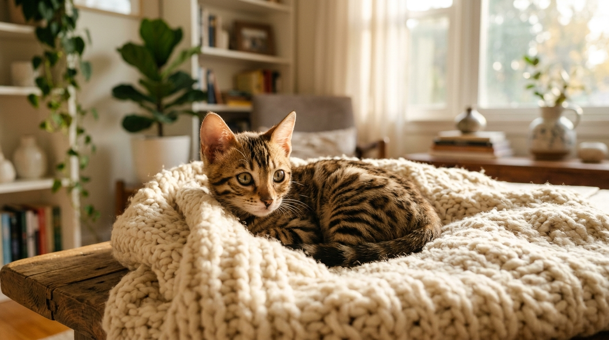
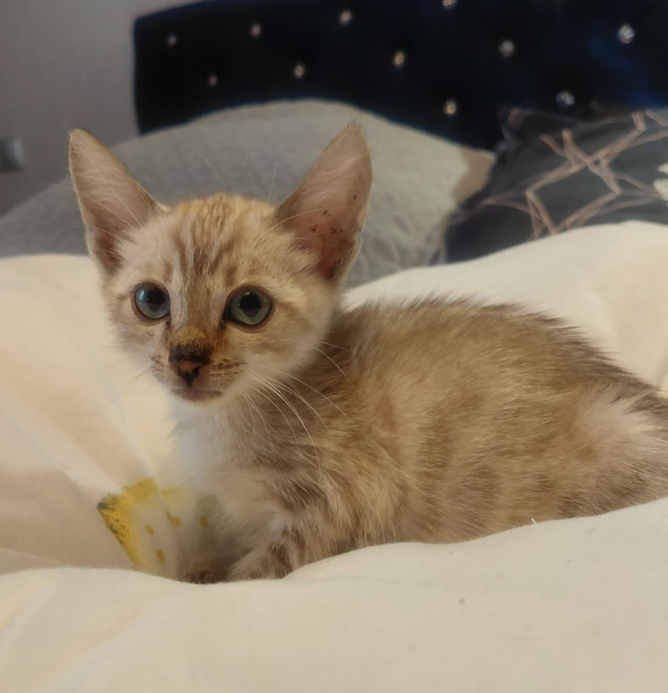
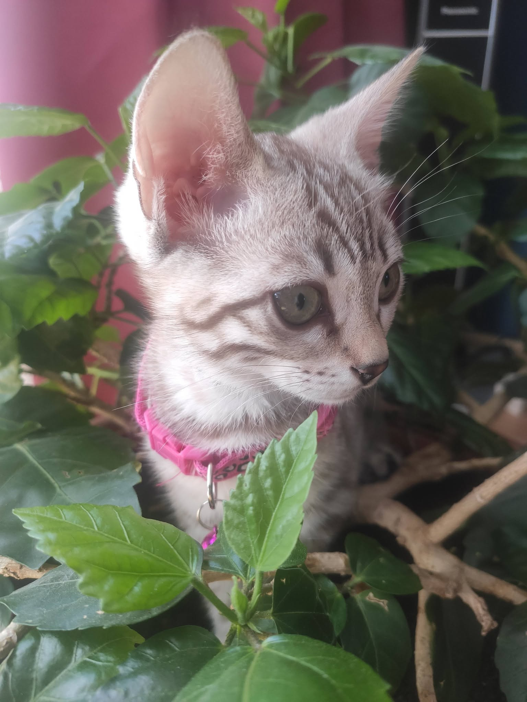

Pierwsze dni kocięcia w nowym domu — jak pomóc maluchowi w adaptacji

Chwila, w której małe kocię bengalskie po raz pierwszy przekracza próg Twojego domu, to ogromne emocje dla całej rodziny — ale także spore wyzwanie dla malucha. Zmiana znanego otoczenia, rozłąka z matką i rodzeństwem oraz nowe zapachy mogą wywołać u kota lekki stres adaptacyjny.

Odpowiedź w pigułce: **Bezstresowa adaptacja kocięcia bengalskiego opiera się na przygotowaniu jednego quiet "pokoju startowego" (safe room), utrzymaniu dokładnie tej samej diety i żwirku z hodowli, wykorzystaniu kocyka z zapachem gniazda oraz zapewnieniu maluchowi spokoju przez pierwsze 24–48 godzin.**

*Zapewnienie poczucia bezpieczeństwa w pierwszych godzinach po przyjeździe ułatwia maluchowi szybką adaptację.*

---

## Pierwsze 24 godziny — strategia "pokoju startowego" (Safe Room)

Popularnym błędem nowych opiekunów jest udostępnienie maluchowi od razu całego mieszkania lub domu. Duża przestrzeń może przytłoczyć małego kota.

Zamiast tego przygotuj jeden przytulny, cichy pokój (np. sypialnię):
1. **Brak hałasów:** Ogranicz głośne dźwięki telewizora, odkurzacza i powstrzymaj wizyty znajomych w pierwszym dniu.
2. **Bliska odległość zasobów:** Umieść kuwetę, miseczkę z wodą i karmą oraz legowisko w jednym pomieszczeniu, w małej odległości od siebie.
3. **Miejsca do schowania:** Zapewnij bezpieczną kryjówkę (np. otwarty transporter z miękkim kocykiem).

Gdy maluch zwiedzi spokojnie jeden pokój i zacznie mruczeć lub szukać z Tobą kontaktu, będzie to znak, że można otworzyć mu drzwi do kolejnych pomieszczeń.

---

## Rola zapachu hodowli — kocyk z zapaszkiem gniazda

W [naszej Hodowli Kotów z Mazowieckiej Szwajcarii](/o-hodowli) w Sikorzu k. Płocka zależy nam na jak najbardziej płynnym przejściu malucha do nowego domu. Dlatego wraz z [kompletną wyprawką](/blog/sztuka-kreowania-domowego-sanktuarium-kompletny-przewodnik-po-wyprawce-premium-dla-kociecia) i dokumentami przekazujemy kocyk lub zabawkę przesiąkniętą zapachem matki i rodzeństwa.

Zapach gniazda działa na kocię uśmierzająco i daje mu poczucie bezpieczeństwa w nowym otoczeniu. Umieść ten kocyk w legowisku lub transporterze.

*Kocięta wychowywane w warunkach domowych szybko budują zaufanie do nowego opiekuna.*

---

## Dieta i kuweta — unikaj nagłych zmian!

Stres związany z przeprowadzka osłabia układ pokarmowy kocięcia. Aby uniknąć rewolucji żołądkowych:
- **Taka sama karma przez pierwsze 14 dni:** Podawaj maluchowi dokładnie tę samą karmę mokrą lub surowe mięso (BARF), które dostawał w hodowli.
- **Identyczny żwirek:** Użyj tego samego rodzaju żwirku w kuwecie, aby kocię bez trudu rozpoznało miejsce do załatwiania potrzeb.

Jeżeli planujesz zmianę karmy na inną, zacznij stopniowe mieszanie dopiero po 2-3 tygodniach od przyjazdu, gdy kocię poczuje się pewnie.

---

## Jak oswoić kota bengalskiego z domownikami i dziećmi?

Bengale to koty niezwykle towarzyskie, aktywne i lgnące do ludzi. [W relacji z dziećmi](/blog/002-kot-bengalski-a-dzieci) sprawdzają się wspaniale, jednak w pierwszych godzinach warto zachować umiar:
- **Daj mu czas:** Pozwól kociakowi pierwszemu podejść i powąchać Twoją dłoń. Nie wyciągaj go na siłę z kryjówki.
- **Zabawa zabawką:** Pierwszy kontakt najlepiej nawiązać przy pomocy wędki z piórkami. Zabawa to dla bengala najlepsza rozładowanie napięcia!
- **Mów spokojnym głosem:** Koty reagują na ton głosu — ciche, ciepłe mówienie upewni malucha, że jest w bezpiecznych rękach.

*Aktywna zabawa piórkiem na wędce pomaga maluchowi szybko przełamać pierwsze lęki.*

---

## Wsparcie hodowcy — jesteśmy pod telefonem!

Kupując malucha z legalnej hodowli SHiOZ ZOOLANDIA, nie zostajesz sam po podpisaniu umowy. Oferujemy stałe wsparcie merytoryczne — jeśli masz pytania dotyczące apetytu, zachowania czy korzystania z kuwety w pierwszych dniach, zawsze możesz do nas zadzwonić.

Więcej o [procesie rezerwacji i odbioru kociąt](/blog/004-kocieta-bengalskie-rezerwacja-i-odbior) oraz [cenach kotów bengalskich](/blog/001-ile-kosztuje-kot-bengalski) znajdziesz w naszych pozostałych wpisach.

---

## 🐾 Szukasz idealnego kocięcia bengalskiego?

W hodowli Kotów z Mazowieckiej Szwajcarii (Sikórz k. Płocka) posiadamy obecnie **5 pięknych kociąt bengalskich**:

- 🏠 **2 starsze kocięta** — w pełni usamodzielnione, z kompletem szczepień i badań, **gotowe do przejścia do nowego domu od zaraz**!
- 🗓️ **3 młodsze kocięta** — w trakcie ostatnich dni socjalizacji, **gotowe do odbioru od przyszłego tygodnia**!

Oferujemy bardzo atrakcyjne, konkurencyjne ceny oraz pełne wsparcie adaptacyjne.

👉 **[Skontaktuj się z nami i poznaj dostępne kocięta →](/contact)**  
📞 **Telefon / WhatsApp:** +48 789 790 846  
📍 **Lokalizacja:** Sikórz k. Płocka (woj. mazowieckie — blisko Warszawy i Łodzi)
