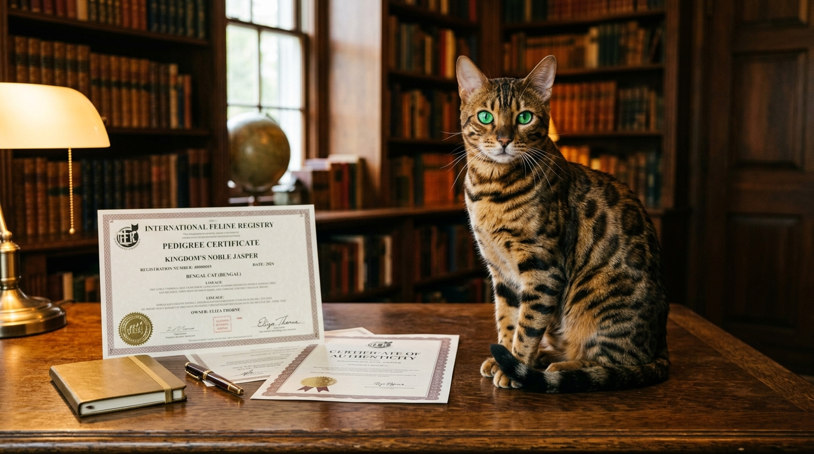

Co zawiera rodowód kota rasowego i dlaczego nie warto kupować bez rodowodu

Pojęcie "rodowodu" bywa powszechnie błędnie rozumiane — niektórzy postrzegają go jako zbędny luksus zderzony z wyższą ceną. Tymczasem oficjalny rodowód to jedyny prawny i biologiczny dowód na to, że kupujesz rasowego kota o przewidywalnym wyglądzie, zdrowiu i temperamentem.

Odpowiedź w pigułce: **Rodowód kota rasowego zawiera pełne dane zwierzęcia (imię, rasa, kod EMS, nr mikrochipa, płeć), drzewo genealogiczne przodków do 4–5 pokoleń wstecz oraz dane hodowli i oficjalnego związku felinologicznego. Gwarantuje czystość rasy, brak inbrodu (chowu wsobnego) oraz ochronę przed dziedzicznymi chorobami genetycznymi.**

*Oficjalny rodowód certyfikowanego związku felinologicznego to dowód tożsamości genetycznej i zdrowia Twojego kota.*

---

## Co to jest rodowód kota rasowego?

Rodowód to urzędowy dokument felinologiczny wydawany przez uznany związek lub federację (np. SHiOZ ZOOLANDIA, FPL/FIFe, WCF, TICA). Jest on od odpowiednikiem aktu urodzenia i dowodu osobistego człowieka.

Bez oficjalnego rodowodu żaden kot — niezależnie od tego, jak bardzo przypomina wyglądem kota bengalskiego, brytyjskiego czy syjamskiego — w świetle prawa felinologicznego **nie jest kotem rasowym**, lecz kotem w typie rasy (mieszańcem).

---

## Co konkretnie zawiera rodowód kota?

Oficjalny dokument rodowodowy wydawany dla kociąt z [naszej Hodowli Kotów z Mazowieckiej Szwajcarii](/o-hodowli) zawiera następujące szczegółowe sekcje:

### 1. Dane identyfikacyjne kota
- **Pełne imię rodowodowe** wraz z przydomkiem hodowlanym (np. *Cyprian z Mazowieckiej Szwajcarii*),
- **Rasa oraz kod EMS** — międzynarodowe oznaczenie felinologiczne (np. `BEN n 24` oznacza kota bengalskiego w maści czarnej czarno-brązowej spotted tabby z rozetami),
- **Numer mikrochipa** — 15-cyfrowy kod unikalny zarejestrowany w baze danych,
- **Płeć i data urodzenia**,
- **Numer rodowodu i numer księgi rodowodowej**.

### 2. Drzewo genealogiczne (4–5 pokoleń wstecz)
W rodowodzie znajduje się dokładnie rozpisane drzewo przodków:
- **Rodzice (F1):** Matka i ojciec z ich imionami, umaszczeniem, numerami rodowodów oraz [badaniami genetycznymi HCM i PKD](/blog/niewidzialne-dziedzictwo-dlaczego-badania-genetyczne-hcm-i-pkd-to-najpiekniejsza-obietnica-dla-twojej-rodziny).
- **Dziadkowie i pradziadkowie (F2–F4):** Przodkowie wraz z międzynarodowymi tytułami wystawowymi (np. *CH — Champion*, *IC — International Champion*, *GIC — Grand International Champion*).

### 3. Dane hodowli i związku
- Nazwa i numer rejestracyjny hodowli (nasz numer: **SHiOZ ZOOLANDIA 58/CW/2025 / Rej. 58/P/2025**),
- Dane hodowcy,
- Pieczęć, podpis organu wydającego oraz hologram zabezpieczający.

*Drzewo genealogiczne w rodowodzie potwierdza brak krzyżowania pokrewnego i stabilny temperament.*

---

## Prawdziwy rodowód a "metryczka" z pseudohodowli — jak nie dać się oszukać?

Ustawa o ochronie zwierząt nakłada obowiązek sprzedaży rasowych zwierząt z rodowodem. Niestety doprowadziło to do powstania tzw. pseudostowarzyszeń, które drukują na domowych drukarkach bezwartościowe papierki.

Oto jak odróżnić prawdziwy rodowód od fałszywki:

| Cecha | Prawdziwy Rodowód (np. SHiOZ / FPL / FIFe) | Pseudorodowód |
|---|---|---|
| **Liczba pokoleń** | Pełne 4–5 pokoleń przodków z numerami ksiąg | Często tylko rodzice (1 pokolenie) lub puste pola |
| **Weryfikacja przodków** | Zarejestrowana baza międzynarodowa | Brak możliwości weryfikacji w jakiejkolwiek bazie |
| **Badania genetyczne** | Obowiązkowe testy HCM, PKD parents | Brak badań rodziców |
| **Cena wydania** | Koszt wydania rodowodu przez związek to ok. 40–60 zł | Pseudohodowca żąda doplata 500–1000 zł za "papier" |

> **Ważne:** W uczciwej hodowli rodowód otrzymujesz **w cenie kocięcia** — nigdy nie ma opcji zakupu kota "taniej bez rodowodu".

---

## Dlaczego nie warto kupować kota "bez rodowodu"?

Kupując kota z niesprawdzonego źródła bez oficjalnej dokumentacji, narażasz się na poważne konsekwencje:

1. **Wady genetyczne i choroby serca:** Bez testów genetycznych rodzeństwa i rodziców kocię może odziedziczyć śmiertelną kardiomiopatię przerostową (HCM) lub wielotorbielowatość nerek (PKD).
2. **Chów wsobny (inkrezywność):** Krycie brata z siostrą lub ojca z córką prowadzi do skrajnego osłabienia odporności i kalectwa.
3. **Nieprzewidywalny charakter:** Brak socjalizacji powoduje lęki, dzikość i niekontrolowaną agresję.

Więcej o [zasadach rezerwacji i odbioru kociąt z legalnej hodowli](/blog/004-kocieta-bengalskie-rezerwacja-i-odbior) oraz [pierwszych dniach w nowym domu](/blog/005-pierwsze-dni-kociecia-w-nowym-domu) przeczytasz w naszych poradnikach.

*Zarejestrowana hodowla zapewnia 100% gwarancji zdrowia genetycznego oraz pełną opiekę poprodukcyjną.*

---

## 🐾 Poznaj rodowite kocięta bengalskie z naszej hodowli

W hodowli Kotów z Mazowieckiej Szwajcarii w Sikorzu k. Płocka oferujemy wyłącznie rodowite kocięta bengalskie z pełną dokumentacją felinologiczną.

Aktualnie posiadamy **5 pięknych kociąt bengalskich**:
- 🏠 **2 starsze kocięta** — w pełni usamodzielnione, z kompletem szczepień i badań, **gotowe do odbioru od zaraz**!
- 🗓️ **3 młodsze kocięta** — gotowe do przejścia do nowego domu **od przyszłego tygodnia**!

Oferujemy bardzo [atrakcyjne i nieco niższe ceny](/blog/001-ile-kosztuje-kot-bengalski) niż średnia rynkowa, gwarantując najwyższy standard opieki.

👉 **[Poznaj naszą hodowlę i zarezerwuj rodowite kocię →](/o-hodowli)**  
📞 **Telefon / WhatsApp:** +48 789 790 846  
📍 **Lokalizacja:** Sikórz k. Płocka (woj. mazowieckie — blisko Warszawy i Łodzi)
