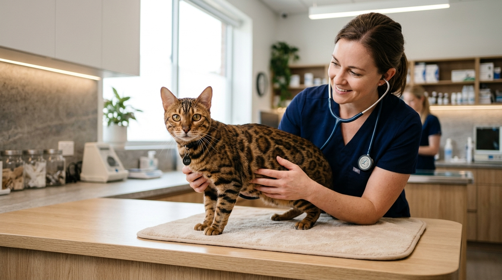

Badania genetyczne HCM i PKD u kotów — dlaczego są kluczowe przed zakupem kociaka

Decyzja o powiększeniu rodziny o kota bengalskiego powinna wiązać się nie tylko z zachwytem nad jego niesamowitym umaszczeniem, ale przede wszystkim z pewnością co do jego zdrowia. Najgroźniejsze schorzenia rasy nie są widoczne gołym okiem w pierwszych tygodniach życia malucha — to tzw. niewidzialne dziedzictwo.

Odpowiedź w pigułce: **Badania genetyczne i kardiologiczne rodziców w kierunku HCM (kardiomiopatii przerostowej) oraz PKD (wielotorbielowatości nerek) to jedyna skuteczna metoda wyeliminowania ryzyka dziedziczenia śmiertelnych wad serca i nerek u kociąt. Odpowiedzialna hodowla wykonuje te testy u każdego kota hodowlanego.**

*Profilaktyka weterynaryjna i regularne badania kardiologiczne rodziców stanowią fundament zdrowia każdego kocięcia.*

---

## Co to jest HCM (Kardiomiopatia Przerostowa Serca)?

HCM (*Hypertrophic Cardiomyopathy*) to najczęstsza wrodzona choroba serca u kotów rasowych. Polega na postępującym pogrubieniu mięśnia lewej komory serca, co z czasem prowadzi do niewydolności krążenia, zatorowości płucnej, a nawet nagłej śmierci sercowej u młodych kotów.

### Jak chronimy koty przed HCM?
- **Badanie echokardiograficzne (Echo serca):** Wykonywane przez wyspecjalizowanego weterynarza kardiologa przy użyciu aparatu USG z funkcją Dopplera.
- **Profilaktyka pokoleniowa:** Wszystkie koty w naszej hodowli przechodzą regularne badania serca, co wyklucza z programu hodowlanego osobniki obciążone wadami.

---

## Co to jest PKD (Wielotorbielowatość Nerek)?

PKD (*Polycystic Kidney Disease*) to uwarunkowane genetycznie schorzenie polegające na tworzeniu się płynowych torbieli w miąższu nerek. Z biegiem lat torbiele powiększają się, niszcząc zdrową tkankę nerkową i prowadząc do nieodwracalnej przewlekłej niewydolności nerek.

### Jak diagnozuje się PKD?
- **Testy DNA:** Wymaz z jamy ustnej lub badanie krwi rodziców wysyłane do certyfikowanego laboratorium genetycznego.
- **USG Nerek:** Uzupełniające badanie obrazowe narządów wewnętrznych.

Wynik testu DNA jest jednoznaczny: kot wolny od mutacji (`PKD n/n`) nigdy nie zachoruje i nie przekaże wadliwego genu swojemu potomstwu.

*Wszystkie koty hodowlane w naszej hodowli posiadają aktualne certyfikaty zdrowia.*

---

## Jak zweryfikować badania genetyczne u hodowcy?

Kupując kocię z certyfikowanej hodowli, masz pełne prawo poprosić hodowcę o przedstawienie wyników badań rodziców malucha. Na co zwrócić uwagę?

1. **Numer microchipa na certyfikacie:** Numer chipa w dokumencie badania musi zgadzać się z numerem chipa matki lub ojca zapisanym w [rodowodzie kota](/blog/006-co-zawiera-rodowod-kota).
2. **Pieczęć lekarza kardiologa:** Echo serca powinno być podbite przez licencjonowanego lekarza weterynarii ze specjalizacją kardiologiczną.
3. **Oficjalne laboratorium genetyczne:** Testy DNA na PKD powinny pochodzić z uznanego laboratorium felinologicznego (np. Laboklin, Genomia).

---

## Standardy zdrowotne w Hodowli Kotów z Mazowieckiej Szwajcarii

W [naszej hodowli w Sikorzu k. Płocka](/o-hodowli) (SHiOZ ZOOLANDIA nr 58/CW/2025) zdrowie kotów jest najwyższym priorytetem:
- 100% kotów hodowlanych posiada udokumentowane badania kardiologiczne i genetyczne.
- Kocięta opuszczają naszą hodowlę w wieku 12–14 tygodni po dwukrotnym zaszczepieniu, odrobaczeniu i zaczipowaniu.
- Przyszłym opiekunom udostępniamy do wglądu pełną dokumentację weterynaryjną podczas [wizyty rezerwacyjnej](/blog/004-kocieta-bengalskie-rezerwacja-i-odbior).

Więcej o [cenach kociąt z badaniami](/blog/001-ile-kosztuje-kot-bengalski), ich [socjalizacji z dziećmi](/blog/002-kot-bengalski-a-dzieci) oraz [pierwszych dniach w nowym domu](/blog/005-pierwsze-dni-kociecia-w-nowym-domu) przeczytasz w pozostałych wpisach naszej bazy wiedzy.

*Wybór kocięcia po zbadanych rodzicach to spokój i bezpieczeństwo dla całej Twojej rodziny na długie lata.*

---

## 🐾 Poznaj nasze zdrowe kocięta bengalskie

W hodowli Kotów z Mazowieckiej Szwajcarii (Sikórz k. Płocka / Mazowieckie) posiadamy aktualnie **5 pięknych, zdrowych kociąt bengalskich**:

- 🏠 **2 starsze kocięta** — w pełni usamodzielnione, z kompletem szczepień i badań, **gotowe do zmiany domu od zaraz**!
- 🗓️ **3 młodsze kocięta** — kończące okres socjalizacji, **gotowe do odbioru od przyszłego tygodnia**!

Oferujemy atrakcyjniejsze i nieco niższe ceny niż średnia rynkowa konkurencji, gwarantując bezkompromisowy standard zdrowotny.

👉 **[Poznaj naszą hodowlę i zobacz certyfikaty naszych kotów →](/o-hodowli)**  
📞 **Telefon / WhatsApp:** +48 789 790 846  
📍 **Lokalizacja:** Sikórz k. Płocka (woj. mazowieckie — blisko Warszawy i Łodzi)
