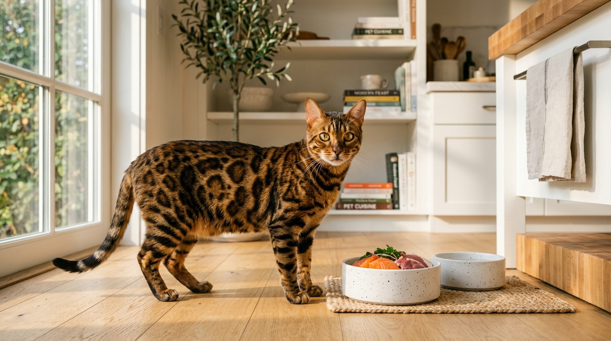

Żywienie kota bengalskiego — co je bengal, jak karmić i jakiej diety potrzebuje

Kot bengalski ze swoim niezwykłym ubarwieniem i umięśnioną, atletyczną sylwetką przypomina miniaturowego lamparta. Aby jednak zachował lśniące futro z głębokim kontrastem rozet, mocne mięśnie i niespożytą energię, potrzebuje diety stworzonej dla bezwzględnego mięsożercy.

Odpowiedź w pigułce: **Dieta kota bengalskiego powinna opierać się na wysokiej jakości karmach mokrych wysokomięsnych (min. 70–80% mięsa i podrobów, bezzbożowych) lub surowym żywieniu biologicznie odpowiednim (dieta BARF z suplementacją tauryny i wapnia). Kot bengalski nie powinien spożywać suchych karm zbożowych ani produktów mlecznych.**

*Właściwe karmienie mięsne to klucz do głębokiego kontrastu futra i doskonałej kondycji kota bengalskiego.*

---

## Dlaczego żywienie kota bengalskiego wymaga szczególnej uwagi?

Koty bengalskie to potomkowie dzikiego kota bengalskiego (*Prionailurus bengalensis*). Choć od pokoleń żyją w naszych domach, ich układ pokarmowy pozostał krótki i przystosowany niemal wyłącznie do trawienia białek i tłuszczów pochodzenia zwierzęcego.

W porównaniu do innych ras, bengale charakteryzują się:
- **Bardzo wysokim metabolizmem:** Spalają ogromne ilości energii podczas codziennych biegów i skoków.
- **Wrażliwym przewodem pokarmowym:** Zboża, kukurydza i sztuczne zapychacze w karmach powodują u nich biegunki i nawracające stany zapalne.
- **Wymaganiami sierściowymi:** Aksamitne futro i charakterystyczny błysk (*glitter*) wymagają kwasów tłuszczowych Omega-3 i Omega-6 w diecie.

---

## Co powinien jeść kot bengalski? 3 rekomendowane filary

W [naszej Hodowli Kotów z Mazowieckiej Szwajcarii](/o-hodowli) w Sikorzu k. Płocka stosujemy wyłącznie żywienie biologicznie odpowiednie. Polecamy trzy sprawdzone metody:

### 1. Bezzbożowa karma mokra wysokomięsna
To najwygodniejszy sposób karmienia domowego. Wybieraj karmy monobiałkowe, w których składzie znajduje się minimum 70–80% czystego mięsa mięśniowego i podrobów (np. z indyka, wołowiny, królika czy kaczki). Karmy nie mogą zawierać pszenicy, kukurydzy, soi, cukru ani sztucznych konserwantów.

### 2. Dieta surowa BARF (*Biologically Appropriate Raw Food*)
To najbardziej naturalna dieta dla kota bengalskiego — składa się ze świeżego, surowego mięsa (wołowina, drób, dziczyzna), podrobów oraz precyzyjnie dobranych suplementów (tauryna, wapń, olej z łososia, drożdże browarnicze). Zapewnia doskonałe stolce, idealną masę mięśniową i piękny błysk sierści. Więcej o tym przeczytasz w naszym przewodniku po [holistycznym żywieniu i diecie BARF](/blog/powrot-do-natury-bez-kompromisow-holistyczne-zywienie-i-dieta-barf-jako-recepta-na-dlugowiecznosc).

### 3. Prawidłowe nawodnienie — fontanny wodne
Koty w naturze czerpią wodę głównie z mięsa ofiar, dlatego z natury piją mało ze stojących misek. Bengale uwielbiają jednak bieżącą wodę! Zainwestuj w automatyczne poidełko (fontannę), które zachęca kota do picia i chroni jego nerki.

*Wszystkie kocięta w naszej hodowli są odchowywane na zbilansowanej diecie mięsnej.*

---

## Czego BEZWZGLĘDNIE unikać w diecie bengala?

- ❌ **Suche karmy zbożowe:** Zawierają węglowodany, które obciążają trzustkę i prowadzą do otyłości oraz stłuszczenia wątroby.
- ❌ **Mleko krowie:** Dorosłe koty nie trawą laktozy, co skutkuje bolesnymi biegunkami.
- ❌ **Gotowane kości:** Mogą rozpaść się na ostre drzazgi i uszkodzić przewód pokarmowy.
- ❌ **Resztki ze stołu:** Cebula, czosnek, przyprawy i sól są toksyczne dla kotów.

---

## Jak karmić kocię bengalskie po odbiorze z hodowli?

Podczas [odbioru kocięcia z hodowli](/blog/004-kocieta-bengalskie-rezerwacja-i-odbior) w Sikorzu k. Płocka otrzymujesz pełną rozpiskę żywieniową oraz pakiet karmy na start.

W [pierwszych dniach w nowym domu](/blog/005-pierwsze-dni-kociecia-w-nowym-domu) podawaj wyłącznie karmę wskazaną przez hodowcę. Kocięta w wieku 3–6 miesięcy karmimy do woli (*ad libitum*) wysokomięsną karmą mokrą 4–5 razy dziennie.

Zapewnienie zdrowia zaczyna się od [wyboru przebadanej hodowli](/blog/003-hodowla-kotow-bengalskich-mazowieckie) wolnej od wad [HCM i PKD](/blog/007-badania-genetyczne-hcm-pkd-koty).

*Prawidłowe żywienie od pierwszych miesięcy życia przekłada się na atletyczną budowę i wieloletnie zdrowie.*

---

## 🐾 Masz pytania o dietę lub szukasz kocięcia?

W hodowli Kotów z Mazowieckiej Szwajcarii służymy poradą żywieniową dla każdego nowego opiekuna.

Aktualnie w naszej hodowli posiadamy **5 pięknych kociąt bengalskich**:
- 🏠 **2 starsze kocięta** — w pełni usamodzielnione, z kompletem szczepień i badań, **gotowe do odbioru od zaraz**!
- 🗓️ **3 młodsze kocięta** — w trakcie ostatnich dni socjalizacji, **gotowe do odbioru od przyszłego tygodnia**!

Oferujemy bardzo [atrakcyjne ceny](/blog/001-ile-kosztuje-kot-bengalski) oraz stały kontakt z hodowcą po zakupie.

👉 **[Skontaktuj się z nami i zapytaj o żywienie oraz dostępne kocięta →](/contact)**  
📞 **Telefon / WhatsApp:** +48 789 790 846  
📍 **Lokalizacja:** Sikórz k. Płocka (woj. mazowieckie — blisko Warszawy i Łodzi)
