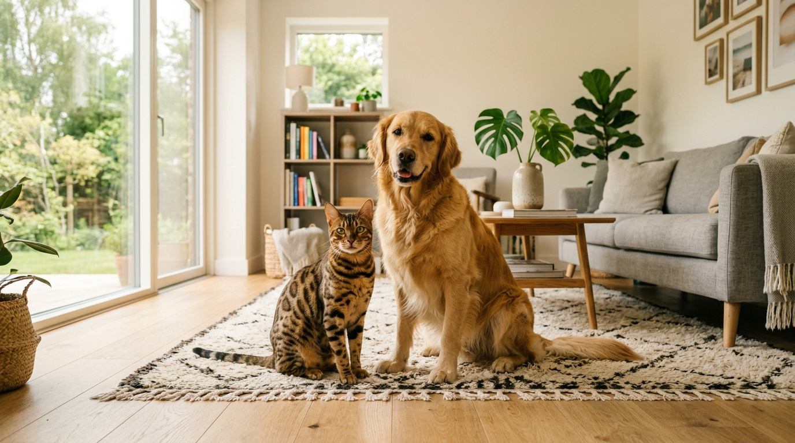

Kot bengalski a inne zwierzęta — relacje z kotami, psami i bezpieczny dom

Osoby posiadające już psa lub innego kota w domu często zastanawiają się, jak dziko wyglądający kot bengalski odnajdzie się w nowym stadzie. Czy jego wysoka energia i instynkt nie doprowadzą do konfliktów domowych?

Odpowiedź w pigułce: **Prawidłowo socjalizowany kot bengalski świetnie dogaduje się z innymi psami i kotami, a ze względu na swoją pewność siebie często tworzy z psami niezwykłe przyjaźnie. Kluczem do sukcesu jest stopniowa "socjalizacja z izolacją" oraz ochrona małych zwierząt domowych (gryzoni i ptaków) przed jego instynktem łowieckim.**

*Pewny siebie kot bengalski i łagodny pies mogą stworzyć idealny duet w domowym salonie.*

---

## Kot bengalski i drugi kot — jak budują relacje?

Bengale to koty wybitnie stadne i aktywne. W przeciwieństwie do samotniczych ras, kot bengalski często ubiega się o towarzysza do biegania i zapasów.

### Jak dobrać drugiego kota do bengala?
- **Zbieżność energii:** Najlepiej łączą się z innymi energicznymi rasami (np. syjamy, koty orientalne, inne bengale) lub młodymi, aktywnymi kotami domowymi.
- **Uwaga na wrażliwe koty:** Łączenie niezwykle aktywnego bengala ze starszym, spokojnym seniorem lub skrajnie lękliwym kotem (np. perskim) może wywołać u tego drugiego stres.

---

## Kot bengalski i pies — niezwykła przyjaźń dwóch energii

Co ciekawe, relacja kota bengalskiego z psem często układa się łatwiej niż z drugim kotem!

Za co bengale kochają psy?
1. **Brak lękliwości:** Dobrze uspołeczniony bengal nie ucieka przed psem ani nie reaguje agresją. Jego pewność siebie budzi u psa respekt.
2. **Wspólna chęć do zabaw:** Bengale uwielbiają aportować i biegać za psem po domu, a nawet spać wtulonym w psie posłanie.

*Kocięta w naszej hodowli w Sikorzu dorastają w sercu domu, co uczy je zaufania do innych zwierząt.*

---

## Krok po kroku: Socjalizacja z izolacją w nowym domu

Niezależnie od tego, czy wprowadzasz bengala do psa, czy drugiego kota, zawsze stosuj procedurę łagodnej adaptacji:

### Krok 1: Wymiana zapachów (24–48h)
W pierwszych dniach trzymaj nowo przybyłe kocię w [przygotowanym pokoju startowym](/blog/005-pierwsze-dni-kociecia-w-nowym-domu). Zamieniaj kocyki i posłania między zwierzętami, aby poznały swój zapach bez fizycznego kontaktu.

### Krok 2: Kontakt wzrokowy przez barierę
Udostępnij zwierzętom możliwość zobaczenia się przez uchylone drzwi z siatką zabezpieczającą lub bramką dziecięcą. Podawaj w tym czasie smakołyki po obu stronach bariery, budując pozytywne skojarzenia.

### Krok 3: Pierwsze kontrolowane spotkanie
Wypuść kocię na neutralny grunt pod ścisłym nadzorem. Psa trzymaj na smyczy. Nagradzaj spokojne zachowanie obu stron.

---

## Uwaga na małe zwierzęta (gryzonie, ptaki, rybki)!

Kot bengalski posiada wyjątkowo wyostrzony instynkt łowiecki. O ile z psami i kotami nawiązuje relacje przyjacielskie, o tyle chomiki, świnki morskie, papugi czy rybki akwariowe traktuje wyłącznie jak potencjalną zdobycz.

- **Klatki i terraria** muszą znajdować się w zamkniętych pomieszczeniach lub być solidnie zabezpieczone.
- **Akwaria** powinny posiadać ciężkie, zamknięte pokrywy.

*Wysoka inteligencja bengala pozwala mu na szybkie zrozumienie domowych zasad przy konsekwentnym opiekunie.*

---

## Standardy socjalizacji w naszej hodowli

W [naszej Hodowli Kotów z Mazowieckiej Szwajcarii](/o-hodowli) w Sikorzu k. Płocka (SHiOZ ZOOLANDIA nr 58/CW/2025) dbamy o to, by kocięta wyrosły na zrównoważonych i śmiałych towarzyszy. Wszystkie maluchy są przeznaczone do życia w otwartych rodzinach z [dziećmi](/blog/002-kot-bengalski-a-dzieci) i innymi zwierzętami.

Przed zakupem chętnie pomożemy Ci ocenić, czy kocię bengalskie odnajdzie się przy Twoim aktualnym pupilu. Więcej o [cenach kociąt](/blog/001-ile-kosztuje-kot-bengalski), [rezerwacji i odbiorze](/blog/004-kocieta-bengalskie-rezerwacja-i-odbior) oraz [badaniach genetycznych HCM i PKD](/blog/007-badania-genetyczne-hcm-pkd-koty) przeczytasz w pozostałych artykułach.

---

## 🐾 Szukasz aktywnego przyjaciela dla swojego psa lub kota?

W naszej hodowli posiadamy aktualnie **5 cudownych kociąt bengalskich**:
- 🏠 **2 starsze kocięta** — w pełni usamodzielnione, z kompletem szczepień i badań, **gotowe do przejścia do nowego domu od zaraz**!
- 🗓️ **3 młodsze kocięta** — kończące proces socjalizacji, **gotowe do odbioru od przyszłego tygodnia**!

Oferujemy bardzo [atrakcyjne i konkurencyjne ceny](/blog/001-ile-kosztuje-kot-bengalski) oraz wsparcie podczas dokocenia.

👉 **[Zobacz nasze dostępne kocięta i porozmawiaj z hodowcą →](/koty)**  
📞 **Telefon / WhatsApp:** +48 789 790 846  
📍 **Lokalizacja:** Sikórz k. Płocka (woj. mazowieckie — blisko Warszawy i Łodzi)
