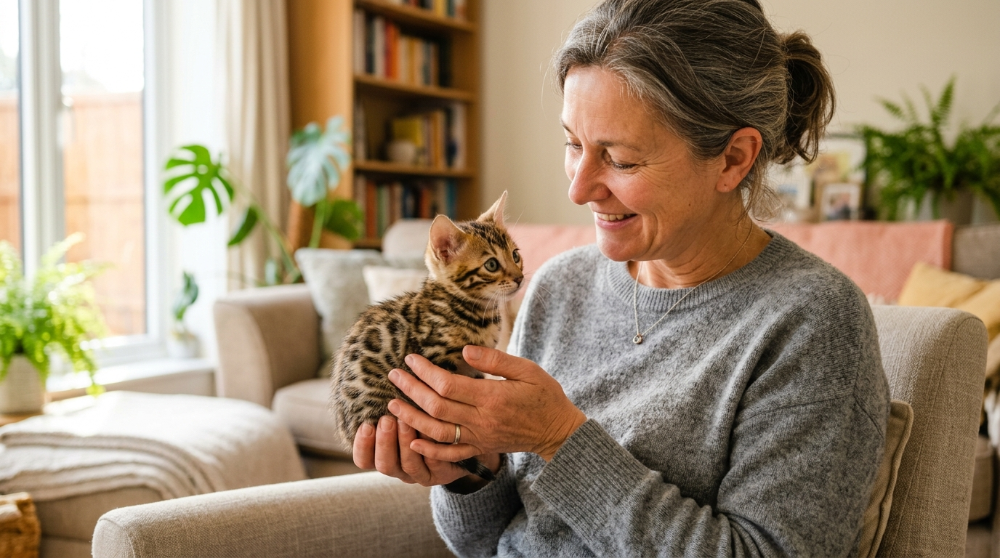

Socjalizacja kociąt w hodowli — jak kształtujemy stabilny charakter kota bengalskiego

Zastanawiając się nad wyborem rasy bengalskiej, wiele osób obawia się ich "dzikiego" wyglądu i pytają, czy kota bengalskiego da się oswoić tak, by był łagodny, ufny i spokojny w relacji z człowiekiem. Odpowiedź leży w pierwszych 12 tygodniach życia malucha — czyli w procesie profesjonalnej socjalizacji w hodowli.

Odpowiedź w pigułce: **Socjalizacja kociąt w hodowli to celowy, wieloetapowy proces oswojenia maluchów z ludzkim dotykiem, hałasami domowymi i innymi zwierzętami, zachodzący w tzw. oknie socjalizacyjnym (między 2. a 12. tygodniem życia). Prawidłowo przeprowadzona socjalizacja domowa eliminuje lęki i wykształca zrównoważony, przyjacielski charakter kota na całe życie.**

*Wczesny kontakt z ludzkimi dłońmi i pełne miłości otoczenie budują niezłomne zaufanie kota do człowieka.*

---

## Czym jest okno socjalizacyjne u kota?

Mózg małego kocięcia w pierwszych tygodniach życia jest niezwykle plastyczny. Okres między 2. a 12. tygodniem nazywany jest **oknem socjalizacyjnym**.

To, czego kocię doświadczy w tym czasie (dobre bodźce, głaskanie, kontakt z odgłosami domowymi), zostanie przez nie zaakceptowane jako coś całkowicie naturalnego i bezpiecznego. Brak bodźców w tym okresie (np. trzymanie w klatkach czy izolowanych pomieszczeniach) prowadzi do utrwalenia lękowości i niekontrolowanych reakcji obronnych.

---

## 3 etapy socjalizacji w naszej hodowli w Sikorzu

W [naszej Hodowli Kotów z Mazowieckiej Szwajcarii](/o-hodowli) w Sikorzu k. Płocka wychowujemy kocięta w sercu naszego domu. Proces socjalizacji dzielimy na 3 etapy:

### Etap 1: Tygodnie 1–3 — Bliskość matki i delikatny stymulacja
W pierwszych dniach najważniejszy jest spokój i więź z matką. Maluchy są jednak od pierwszego tygodnia delikatnie głaskane i brane na dłonie na kilka sekund dziennie. Dzięki temu zapach człowieka staje się dla nich synonimem ciepła i bezpieczeństwa.

### Etap 2: Tygodnie 4–7 — Odkrywanie świata i dźwięków
Kiedy kocięta zaczynają sprawnie chodzić, stykają się z codziennym domowym życiem:
- **Dźwięki domowe:** Przyzwyczajamy je do odkurzacza, pralki, dzwonka do drzwi, śmiechu i kroków.
- **Nauka czystości:** Kocięta podpatrują matkę i rozpoczynają korzystanie z kuwety oraz pionowych drapaków.
- **Pierwsze zabawy:** Wprowadzamy wędki z piórkami, piłeczki i tunele, ucząc maluchy, że zabawki służą do polowania, a ludzkie dłonie wyłącznie do pieszczot.

### Etap 3: Tygodnie 8–12 — Budowanie pewności siebie i relacji
To czas intensywnego rozwoju społecznego. Kocięta uczą się od matki i rodzeństwa tzw. hamowania gryzienia i chowania pazurków. Przebywają z nami podczas codziennych obowiązków, poznając dorosłych oraz [dzieci](/blog/002-kot-bengalski-a-dzieci) i [inne zwierzęta](/blog/009-kot-bengalski-a-inne-zwierzeta).

*Wszystkie nasze kocięta dorastają w otwartych przestrzeniach domowych bez klatek.*

---

## Dlaczego nie wolno odbierać kocięcia przed 12. tygodniem życia?

Nieuczciwi sprzedawcy z pseudohodowli często oferują oddanie kociąt już w 6–8. tygodniu życia ("bo już samodzielnie jedzą").

To ogromna krzywda dla zwierzęcia:
- **Brak nauki emocjonalnej:** Kocię pozbawione korekty ze strony matki między 8. a 12. tygodniem często wykazuje agresję lękową, mocno gryzie i podrapuje opiekunów.
- **Stres i spadek odporności:** Wczesne odłączenie drastycznie obniża odporność organizmu.

Zgodnie ze standardami oficjalnych federacji felinologicznych (w tym SHiOZ ZOOLANDIA nr 58/CW/2025) kocię opuszcza hodowlę dopiero po ukończeniu 12–14 tygodni — z pełną dojrzałością emocjonalną i kompletem szczepień. Więcej o tym w przewodniku po [rezerwacji i odbiorze kociąt](/blog/004-kocieta-bengalskie-rezerwacja-i-odbior).

*Zrównoważony charakter to zasługa miesięcy pracy hodowcy i bezpiecznego otoczenia.*

---

## Odwiedź naszą hodowlę i sprawdź efekt socjalizacji!

Serdecznie zapraszamy do odwiedzenia naszej hodowli w Sikorzu k. Płocka (woj. mazowieckie). Osobiście przekonasz się, jak bardzo ufne, łagodne i spragnione pieszczot są nasze maluchy.

Możesz u nas sprawdzić również [badania genetyczne HCM i PKD](/blog/007-badania-genetyczne-hcm-pkd-koty), [rodowody parents](/blog/006-co-zawiera-rodowod-kota) oraz porozmawiać o [pierwszych dniach w nowym domu](/blog/005-pierwsze-dni-kociecia-w-nowym-domu).

---

## 🐾 Poznaj nasze socjalizowane kocięta bengalskie

W hodowli Kotów z Mazowieckiej Szwajcarii posiadamy obecnie **5 cudownych kociąt bengalskich**:

- 🏠 **2 starsze kocięta** — w pełni usamodzielnione, po pełnym procesie socjalizacji, **gotowe do zmiany domu od zaraz**!
- 🗓️ **3 młodsze kocięta** — kończące proces wychowawczy, **gotowe do odbioru od przyszłego tygodnia**!

Oferujemy bardzo [atrakcyjne ceny](/blog/001-ile-kosztuje-kot-bengalski) oraz wsparcie po zakupie.

👉 **[Poznaj naszą hodowlę i zarezerwuj malucha →](/o-hodowli)**  
📞 **Telefon / WhatsApp:** +48 789 790 846  
📍 **Lokalizacja:** Sikórz k. Płocka (woj. mazowieckie — blisko Warszawy i Łodzi)
