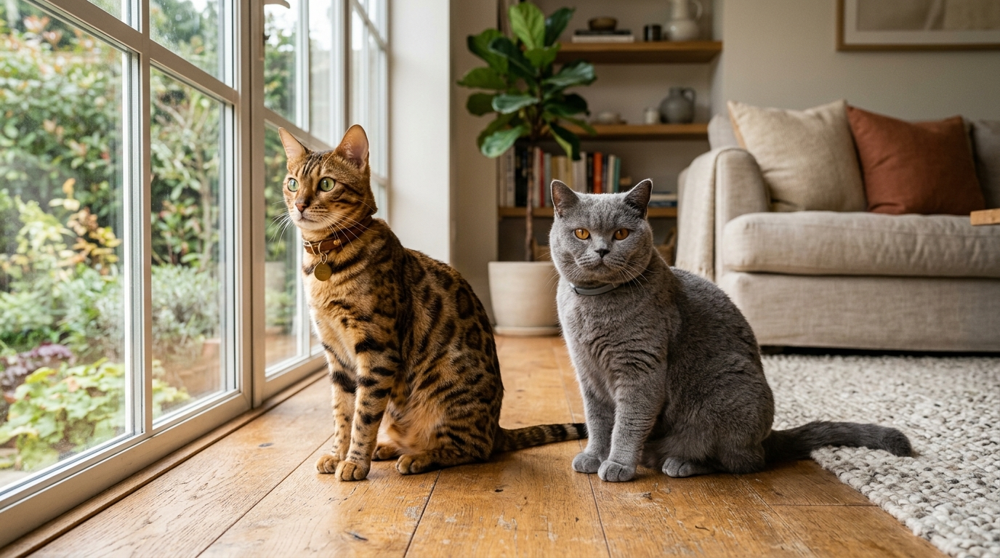
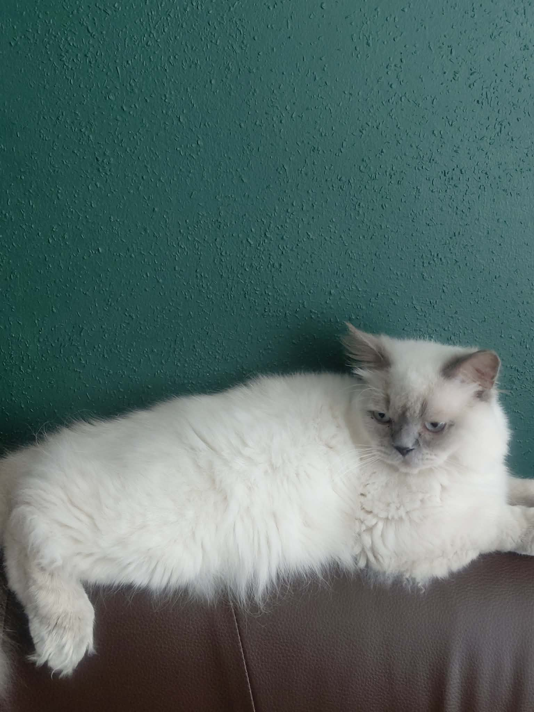

Kot bengalski czy brytyjski — porównanie cech, charakteru, pielęgnacji i kosztów

Wybór idealnego kota rasowego do domu to jedna z najważniejszych decyzji felinologicznych. Na polskim rynku ogromną popularnością cieszą się dwie skrajnie różne rasy: **kot bengalski** — przypominający dzikiego mini-lamparda o wulkanie energii, oraz **kot brytyjski krótkowłosy** — oazie spokoju i wyglądem pluszowej maskotki.

Odpowiedź w pigułce: **Wybierz kota bengalskiego, jeśli szukasz aktywnego, niezwykle inteligentnego i "psiego" towarzysza do stałej zabawy i interakcji z rodziną. Wybierz kota brytyjskiego, jeśli cenisz spokój, aksamitną harmonię, niezależność i cichego pupila, który doskonale znosi czas spędzony samotnie podczas Twojej pracy.**

*Wybór między kotem bengalskim a brytyjskim to wybór dwóch zupełnie różnych stylów domowego życia.*

---

## Tabela porównawcza: Kot Bengalski vs Kot Brytyjski

Oto bezpośrednie zestawienie najważniejszych parametrów użytkowych i charakterologicznych obydwu ras:

| Cecha / Parametr | Kot Bengalski | Kot Brytyjski Krótkowłosy |
|---|---|---|
| **Poziom energii i ruchu** | ⚡ Bardzo wysoki (wulkan energii, skoki) | 🌿 Niski / Umiarkowany (spokojny relaks) |
| **Temperament** | Niezwykle ciekawy świata, wokalny, "psi" charakter | Zrównoważony, niezależny, łagodny obserwatorem |
| **Relacja z dziećmi** | Uwielbia aktywne zabawy wędka i aportowanie | Cierpliwy, łagodny spectator nieprzepadający za noszeniem |
| **Wokalizacja (głos)** | Głośny, komunikatywny (opowiada, tryluje) | Bardzo cichy, rzadko miauczy |
| **Pielęgnacja sierści** | Znikoma (brak podszerstka, gładka maść) | Średnia (gęsty podszerstek wymaga szczotkowania) |
| **Tolerancja samotności** | Wymaga uwagi lub drugiego kota | Dobrze znosi godziny pracy właściciela |
| **Miłość do wody** | 💦 Ogromna (bawi się wodą w kranie) | Obojętna / Unika kąpieli |

---

## Kot Bengalski — wulkan energii i pasjonat zabawy

Kot bengalski to prawdziwy artysta w ciele małego drapieżnika. Posiada gładkie futro z efektownymi rozetami oraz połyskiem (*glitter*).

*Kota bengalskiego cechuje niezwykły kontrast maści i niekończąca się chęć do zabawy.*

### Dla kogo bengal będzie strzałem w dziesiątkę?
- Dla rodzin aktywnych i [rodzin z dziećmi](/blog/002-kot-bengalski-a-dzieci), które chcą biegać z kotem po domu.
- Dla osób szukających "kota jak pies", który będzie chodził na smyczy, aportował i towarzyszył w domowych obowiązkach.
- Dla osób szukających kota bez podszerstka, który niemal nie linieje.

---

## Kot Brytyjski — aksamitny spokój i domowa harmonia

Kot brytyjski krótkowłosy zachwyca krągłą głową, głębokim spojrzeniem i gęstym, pluszowym futrem.

*Nasz reproduktor rasy brytyjskiej Staś — oaza spokoju, godności i aksamitnego dotyku.*

### Dla kogo brytyjczyk będzie idealny?
- Dla osób zapracowanych, spędzających 8–10 godzin w pracy.
- Dla miłośników cichych domów, gdzie ceni się spokój i niezależność.
- Dla osób, które lubią głaskać gęste, pluszowe futro i cenią wyważony temperament.

---

## Porównanie kosztów zakupu i utrzymania

[Ceny rynkowe kociąt obu ras z rodowodem](/blog/001-ile-kosztuje-kot-bengalski) w Polsce są zbliżone i kształtują się w granicach **3 000 zł – 5 000 zł** za klasę PET (pupil domowy).

Zarówno bengale, jak i brytyjczyki wymagają diety [wysokomięsnej bez zbóż](/blog/008-zywienie-kota-bengalskiego) oraz obligatoryjnych [badań genetycznych parents (HCM, PKD)](/blog/007-badania-genetyczne-hcm-pkd-koty).

> **W Hodowli Kotów z Mazowieckiej Szwajcarii w Sikorzu k. Płocka:**  
> Prowadzimy odchów **zarówno kotów bengalskich, jak i brytyjskich**! Oferujemy atrakcyjniejsze i nieco niższe ceny niż średnia rynkowa konkurencji, zapewniając 100% zdrowia genetycznego, oficjalne [rodowody SHiOZ ZOOLANDIA](/blog/006-co-zawiera-rodowod-kota) oraz pełen pakiet [socjalizacji domowej](/blog/010-socjalizacja-kociat-w-hodowli).

---

## Odwiedź naszą hodowlę i poznaj obie rasy na żywo!

Nie musisz wybierać na podstawie samych opisów w internecie. Zapraszamy do odwiedzenia naszej hodowli w Sikorzu (powiat płocki, woj. mazowieckie — blisko Warszawy i Łodzi).

Na miejscu zobaczysz nasze [kocięta bengalskie](/blog/004-kocieta-bengalskie-rezerwacja-i-odbior) oraz zapoznasz się z naszymi dorosłymi kotami brytyjskimi (m.in. reproduktorem Stasiem). Pomogą Ci osobiście podjąć najlepszą decyzję dla Twojego stylu życia.

---

## 🐾 Dostępne koty w naszej hodowli

W tej chwili w naszej hodowli w Sikorzu posiadamy **5 pięknych kociąt bengalskich**:
- 🏠 **2 starsze kocięta** — w pełni usamodzielnione, z kompletem szczepień i badań, **gotowe do odbioru od zaraz**!
- 🗓️ **3 młodsze kocięta** — w trakcie ostatnich dni socjalizacji, **gotowe do odbioru od przyszłego tygodnia**!

👉 **[Zobacz dostępne koty i porozmawiaj z hodowcą →](/koty)**  
📞 **Telefon / WhatsApp:** +48 789 790 846  
📍 **Lokalizacja:** Sikórz k. Płocka (woj. mazowieckie — blisko Warszawy, Płocka i Łodzi)
