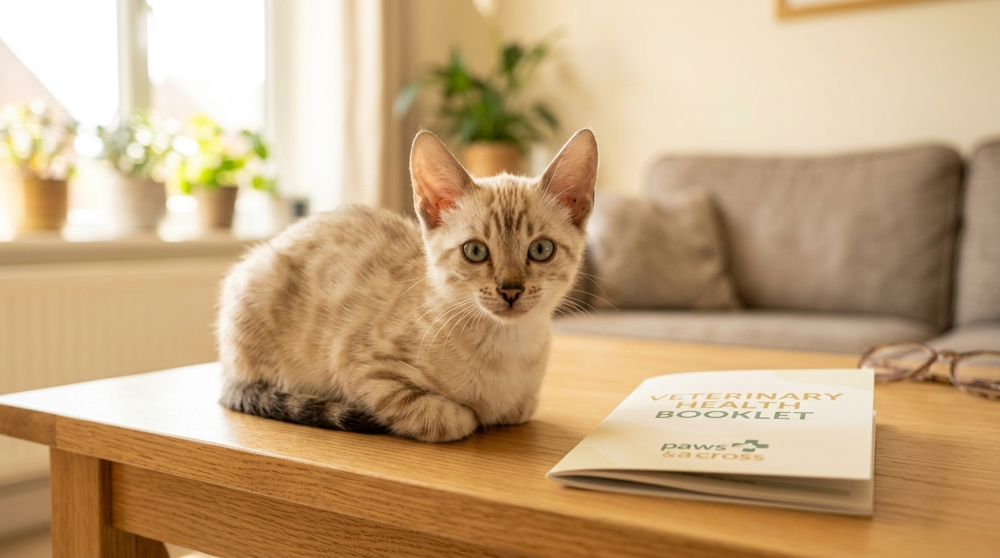

Szczepienia kociąt — harmonogram, cena, zalecenia i najczęstsze pytania opiekunów

Planując powiększenie rodziny o małego kota rasowego, profilaktyka weterynaryjna powinna znajdować się na szczycie Twojej listy priorytetów. Szczepienia stanowią najważniejszą tarczę ochronną przed groźnymi chorobami zakaźnymi, które dla małego organizmu mogą być śmiertelne.

Odpowiedź w pigułce: **Pierwsze szczepienie kocięcia wykonuje się w 8.–9. tygodniu życia, a drugie szczepienie powtórzeniowe (booster) w 12.–13. tygodniu. Odpowiedzialna hodowla wydaje maluchy do nowych domów dopiero po ukończeniu 12–14 tygodni, gdy kocię posiada pełną odporność poszczepienną przeciwko panleukopenii, kaliciwirusozie i herpeswirusozie.**

*Zapewnienie pełnej profilaktyki weterynaryjnej w hodowli gwarantuje silną odporność malucha od pierwszych dni.*

---

## Przed czym chronią podstawowe szczepienia kota?

Zgodnie z wytycznymi Światowego Stowarzyszenia Lekarzy Weterynarii Małych Zwierząt (WSAVA), każdy kot — niezależnie od tego, czy będzie wychodzący, czy domowy — powinien otrzymać tzw. **szczepienia zasadnicze (core vaccines)**:

1. **Panleukopenia (nosówka kotów):** Bardzo zakaźna i śmiertelna choroba wirusowa atakująca układ pokarmowy i odpornościowy.
2. **Kaliciwirusoza (FCV):** Wirus wywołujący bolesne owrzodzenia w jamie ustnej, gorączkę i zapalenie płuc.
3. **Herpeswirusoza (FHV-1 / katar koci):** Wirus atakujący górne drogi oddechowe i oczy, mogący prowadzić do przewlekłych powikłań.

---

## Oficjalny harmonogram szczepień kociąt krok po kroku

Dlaczego nie można zaszczepić kocięcia w pierwszym miesiącu życia? Przez pierwsze tygodnie maluch jest chroniony przez przeciwciała matczyne przekazane w siarze. Ich poziom powoli spada między 6. a 8. tygodniem (tzw. luka immunologiczna) — i to jest idealny moment na rozpoczęcie własnej profilaktyki.

### Kalendarz profilaktyczny:
- 📌 **8.–9. tydzień życia:** I Szczepienie zasadnicze (trójka: Panleukopenia + Kaliciwirus + Herpeswirus) + odrobaczenie + mikrocip.
- 📌 **12.–13. tydzień życia:** II Szczepienie powtórzeniowe (booster dający pełną odporność).
- 📌 **12. miesiąc życia:** I Szczepienie przypominające (po roku od dawki dziecięcej).
- 📌 **Co 2–3 lata:** Szczepienia przypominające dla domowych kotów dorosłych.

*Nasze maluchy w Sikorzu przechodzą pełny cykl profilaktyczny pod stałym nadzorem lekarza weterynarii.*

---

## Standard profilaktyki w naszej hodowli w Sikorzu

W [naszej Hodowli Kotów z Mazowieckiej Szwajcarii](/o-hodowli) w Sikorzu k. Płocka (SHiOZ ZOOLANDIA nr 58/CW/2025) zdrowie kociąt traktujemy absolutnie bezkompromisowo:

- Każde kocię opuszcza hodowlę w wieku **min. 12–14 tygodni**.
- Maluch posiada **dwa kompletne szczepienia zasadnicze**, dwukrotne odrobaczenie oraz zarejestrowany microchip.
- Opiekun otrzymuje [oficjalny rodowód SHiOZ](/blog/006-co-zawiera-rodowod-kota), Książeczkę Zdrowia Kota oraz wpisy o wykonanych badaniach rodziców w kierunku [HCM i PKD](/blog/007-badania-genetyczne-hcm-pkd-koty).

Nigdy nie wydajemy kociąt po jednym szczepieniu — pełna odporność buduje się dopiero po dawce przypominającej w 12. tygodniu.

---

## Ile kosztuje szczepienie kota?

Cena jednego szczepienia zasadniczego w gabinecie weterynaryjnym w Polsce wynosi średnio **80 zł – 140 zł**.

Kupując kocię w naszej hodowli, **pełen koszt dwóch szczepień, mikrochipa, odrobaczeń i książeczki zdrowia jest już włączony w cenę kociaka**. Oferujemy bardzo [atrakcyjne i konkurencyjne ceny](/blog/001-ile-kosztuje-kot-bengalski) w stosunku do średniej rynkowej.

Szczegóły dotyczące przygotowania do przyjazdu malucha znajdziesz w poradniku o [pierwszych dniach w nowym domu](/blog/005-pierwsze-dni-kociecia-w-nowym-domu) oraz [rezerwacji i odbiorze](/blog/004-kocieta-bengalskie-rezerwacja-i-odbior).

*Kupując rodowite kocię z naszej hodowli, otrzymujesz malucha w pełni zabezpieczonego zdrowotnie.*

---

## 🐾 Szukasz zdrowego, zaszczepionego kocięcia?

W hodowli Kotów z Mazowieckiej Szwajcarii posiadamy obecnie **5 cudownych kociąt bengalskich**:
- 🏠 **2 starsze kocięta** — w pełni usamodzielnione, po dwóch szczepieniach, **gotowe do zmiany domu od zaraz**!
- 🗓️ **3 młodsze kocięta** — w trakcie ostatnich dni profilaktyki, **gotowe do odbioru od przyszłego tygodnia**!

👉 **[Skontaktuj się z nami i dowiedz się więcej o naszej profilaktyce →](/contact)**  
📞 **Telefon / WhatsApp:** +48 789 790 846  
📍 **Lokalizacja:** Sikórz k. Płocka (woj. mazowieckie — blisko Warszawy i Łodzi)
