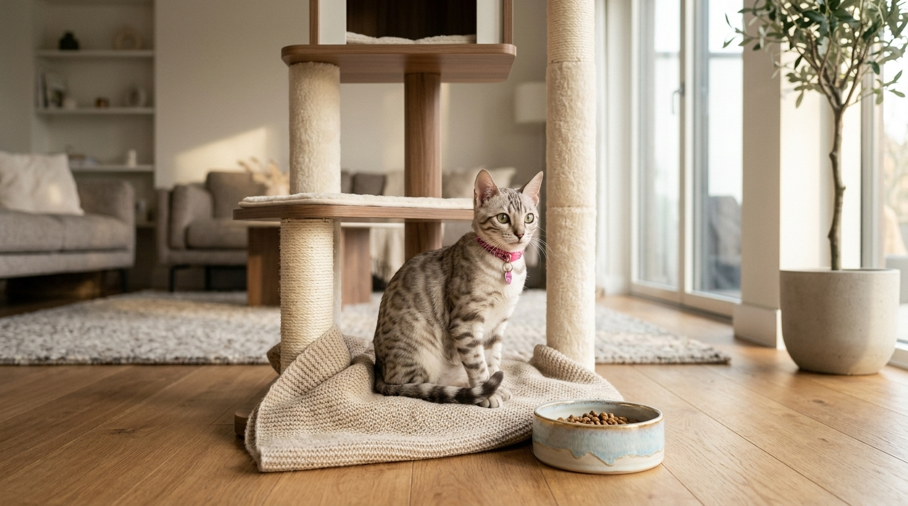

Wyprawka dla kociaka — kompletna lista zakupów, niezbędne akcesoria i porady hodowcy

Przyjęcie pod swój dach małego kota rasowego to wyczekiwany moment, któremu towarzyszy mnóstwo radości. Aby jednak uniknąć niepotrzebnego chaosu i kupowania zbędnych gadżetów, warto wcześniej skompletować rzetelną listę zakupową dopasowaną do potrzeb kocięcia.

Odpowiedź w pigułce: **Niezbędna wyprawka dla kocięcia obejmuje 5 podstawowych obszarów: 1) Stabilny, pionowy drapak (min. 120 cm), 2) Kuwetę ze żwirkiem rekomendowanym przez hodowcę, 3) Miseczki ceramiczne/stalowe oraz fontannę na wodę, 4) Transporter z bezpiecznym zamknięciem, 5) Wędki z piórkami do zabawy. Resztę akcesoriów (karma na start, kocyk z zapachem gniazda, rodowód i dokumenty) otrzymujesz w pakiecie od profesjonalnego hodowcy.**

*Przygotowanie bezpiecznej i kompletnej wyprawki ułatwia maluchowi bezstresowe wejście w nowe domowe życie.*

---

## Lista zakupów — Wyprawka dla kocięcia (Checklist 2026)

Oto sprawdzone zestawienie niezbędnych akcesoriów podzielone na priorytety:

| Kategoria | Akcesorium | Dlaczego jest niezbędne? |
|---|---|---|
| 🥣 **Żywienie** | 2-3 miseczki ceramiczne / stalowe | Higieniczne, łatwe do mycia, nie zmieniają smaku karmy |
| 💧 **Nawodnienie** | Automatyczna fontanna na wodę | Bengale kochają bieżącą wodę — zachęca do częstego picia |
| 🚽 **Higiena** | Kuweta (kryta lub odkryta) + łopatka | Bezpieczna przestrzeń do załatwiania potrzeb |
| 🪵 **Drapanie** | Drapak pionowy (min. 120–150 cm) | Ochrona mebli i możliwość wspinaczki dla aktywnego bengala |
| 🛏️ **Odpocznienie** | Wygodne legowisko lub hamak | Miejsce wyciszenia i bezpiecznego azylu |
| 🚗 **Transport** | Transporter z otwieraną górą | Niezbędny przy odbiorze z hodowli i wizytach u weterynarza |
| 🪟 **Bezpieczeństwo** | Siatka ochronna na okna / balkon | Zabezpieczenie przed wypadnięciem skocznego kota |
| 🧸 **Zabawa** | Wędka z piórkami, piłeczki | Stymulacja intelektualna i fizyczna |

---

## 5 filarów domowej wyprawki krok po kroku

### 1. Strefa Żywienia — higiena i nawodnienie
Koty nie lubią jeść w pobliżu kuwety. Miski na karmę mokrą i wodę powinny stać w cichym miejscu. Unikaj plastikowych misek — łatwo ulegają zarysowaniom, w których gromadzą się bakterie wywołujące trądzik brody u kota.

### 2. Strefa Higieny — kuweta i właściwy żwirek
W [pierwszych dniach w nowym domu](/blog/005-pierwsze-dni-kociecia-w-nowym-domu) użyj **dokładnie tego samego żwirku**, którego kocię używało w hodowli. Dobrej jakości żwirek bentonitowy drobnozarnisty lub drewniany gwarantuje, że maluch bez problemu trafi do kuwety.

### 3. Strefa Drapania — stabilność to podstawa
Kot bengalski to rasowy wspinacz. Zwykły, mały drapak o wysokości 50 cm przewróci się przy pierwszym skoku. Wybierz stabilny drapak z grubymi słupkami sisalowymi o wysokości minimum 120 cm, który umożliwi rozciągnięcie całego ciała.

*Wysoki i stabilny drapak z platformami obserwacyjnymi to ulubione miejsce każdego bengala.*

---

## Co otrzymujesz w wyprawce z naszej hodowli?

W [naszej Hodowli Kotów z Mazowieckiej Szwajcarii](/o-hodowli) w Sikorzu k. Płocka (SHiOZ ZOOLANDIA nr 58/CW/2025) dbamy o to, by nowy opiekun miał ułatwiony start.

Wraz z zaszczepionym i zaczipowanym maluchem przy [odbiorze kocięcia](/blog/004-kocieta-bengalskie-rezerwacja-i-odbior) otrzymujesz:
- **Oficjalny Rodowód SHiOZ** i Książeczkę Zdrowia,
- **Zapas karmy wysokomięsnej** na pierwsze 7–10 dni,
- **Ulubioną zabawkę oraz kocyk** przesiąknięty zapachem gniazda i matki,
- **Poradnik żywieniowy i pielęgnacyjny**,
- **Gwarancję wsparcia hodowcy** na całe życie kota.

---

## Czego NIE kupować przed przyjazdem kocięcia? (Najczęstsze błędy)

- ❌ **Szelek i smyczy na start:** Pierwsze spacery planuj dopiero po pełnym zadomowieniu się kota (po kilku miesiącach).
- ❌ **Karmy suchej ze zbożami:** Zgodnie z [zasadami żywienia kota bengalskiego](/blog/008-zywienie-kota-bengalskiego) podajemy wyłącznie karmy mokre wysokomięsne lub surową dietę BARF.
- ❌ **Zbyt wielu zabawek na raz:** Kocię szybko przebodźcuje się ilością przedmiotów. Wystarczą 2-3 wędki dawkowane pod kontrolą.

Więcej o [cenach kociąt z wyprawką](/blog/001-ile-kosztuje-kot-bengalski), ich [socjalizacji z dziećmi](/blog/002-kot-bengalski-a-dzieci) oraz [profilaktyce szczepiennej](/blog/012-szczepienia-kociat-harmonogram) przeczytasz w naszej bazie wiedzy.

*Kompletując wyprawkę z głową, zapewniasz kociakowi doskonały i bezpieczny start w nowym domu.*

---

## 🐾 Gotowy na przyjęcie malucha? Poznaj nasze kocięta!

W hodowli Kotów z Mazowieckiej Szwajcarii (Sikórz k. Płocka / Mazowieckie) posiadamy w tej chwili **5 cudownych kociąt bengalskich**:

- 🏠 **2 starsze kocięta** — w pełni usamodzielnione, z kompletem szczepień i wyprawką, **gotowe do zmiany domu od zaraz**!
- 🗓️ **3 młodsze kocięta** — kończące socjalizację, **gotowe do odbioru od przyszłego tygodnia**!

Oferujemy bardzo atrakcyjne, konkurencyjne ceny oraz pełne wsparcie merytoryczne.

👉 **[Zobacz nasze dostępne kocięta bengalskie i skontaktuj się z nami →](/koty)**  
📞 **Telefon / WhatsApp:** +48 789 790 846  
📍 **Lokalizacja:** Sikórz k. Płocka (woj. mazowieckie — blisko Warszawy i Łodzi)
