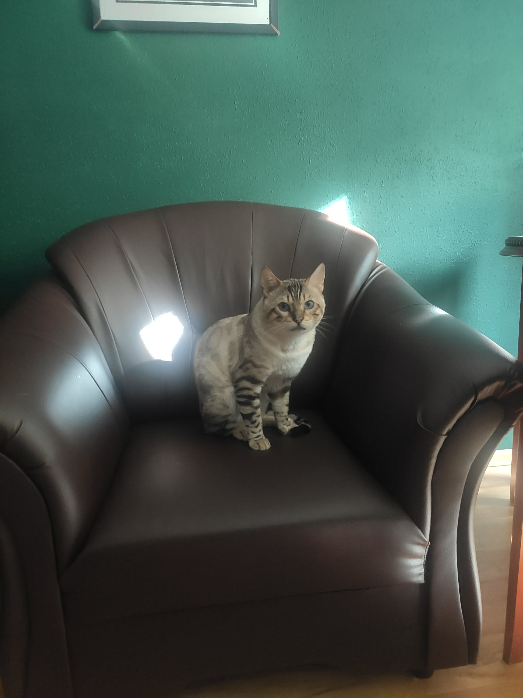

Kot bengalski — przewodnik po rasie: charakter, wymagania, zdrowie i opieka

Kot bengalski to bez wątpienia jedna z najbardziej spektakularnych rasy kotów domowych na świecie. Łącząc dziki, egzotyczny wygląd krawędzi dzikiej natury z łagodnym, niezwykle przyjacielskim charakterem, podbija serca miłośników zwierząt.

Odpowiedź w pigułce: **Kot bengalski to energiczny, wybitnie inteligentny i komunikatywny kot rasowy o charakterze przypominającym psa. Wymaga aktywnego opiekuna, drapaków wspinaczkowych oraz diety wysokomięsnej. Kupowany z certyfikowanej hodowli z badaniami genetycznymi (HCM, PKD) jest okazem zdrowia i wspaniałym towarzyszem dla całej rodziny.**

*Nasz reproduktor rasy bengalskiej Luki — przykład idealnego wzorca rasy, atletycznej budowy i głębokich rozet.*

---

## Historia i wygląd rasy — miniaturowy lampard w Twoim domu

Rasa powstała w latach 60. XX wieku w USA w wyniku skrzyżowania dzikiego kota bengalskiego (*Prionailurus bengalensis*) z kotem domowym. Współczesny bengal z oficjalnym [rodowodem felinologicznym](/blog/006-co-zawiera-rodowod-kota) jest w 100% kotem domowym o stabilnym, bezpiecznym usposobieniu.

### Cechy charakterystyczne wyglądu:
- **Niezwykłe umaszczenie:** Wyraziste rozety (plamki dwukolorowe) lub marmurkowe wzory na złocisto-brązowym, srebrnym lub śnieżnym tle.
- **Efekt Glitter:** Unikalny złoty lub srebrny błysk futra w świetle słonecznym.
- **Aksamitna sierść:** Krótka, jedwabista maść bez podszerstka, która niemal nie linieje.

---

## Charakter i temperament kota bengalskiego

Bengale to koty o "psim charakterze". Nie są biernolitami spędzającymi całe dnie na kanapie — szukają stałej interakcji z domownikami:

- **Niezwykła inteligencja:** Z łatwością uczą się otwierania drzwi, aportowania piłeczek i chodzenia na smyczy.
- **Komunikatywność:** Opowiadają o swoich emocjach cichym gruchaniem, trylami i charakterystycznymi dźwiękami.
- **Uwielbienie wody:** W przeciwieństwie do większości kotów, bengale chętnie bawią się wodą z kranu czy wskakują do wanny.

*Kocięta bengalskie wyróżniają się ciekawością świata i natychmiastowym budowaniem relacji z ludźmi.*

---

## Wymagania mieszkaniowe i relacje w domu

### 1. Przestrzeń do wspinaczki
Bengale potrzebują ruchu w wymiarze pionowym. [Wyprawka dla kocięcia](/blog/013-wyprawka-dla-kociaka-lista) musi zawierać stabilny drapak pionowy o wysokości minimum 120–150 cm lub półki ścienne.

### 2. Dzieci i inne zwierzęta
Prawidłowo [socjalizowany bengal](/blog/010-socjalizacja-kociat-w-hodowli) jest wspaniałym kompanem dla [dzieci](/blog/002-kot-bengalski-a-dzieci) oraz świetnie odnajduje się w domu z [psami lub innymi kotami](/blog/009-kot-bengalski-a-inne-zwierzeta).

---

## Zdrowie i żywienie kota bengalskiego

### Dieta wysokomięsna
Więcej o [żywieniu kota bengalskiego](/blog/008-zywienie-kota-bengalskiego) przeczytasz w naszym przewodniku. Jako bezwzględni mięsożercy potrzebują karmy mokrej bezzbożowej lub surowej diety BARF.

### Badania profilaktyczne
Kupując kota bengalskiego, absolutnym warunkiem są [badania genetyczne HCM (serce) oraz PKD (nerki)](/blog/007-badania-genetyczne-hcm-pkd-koty) u obojga rodziców.

*Każde kocię z naszej hodowli opuszcza dom po dwóch szczepieniach, zaczipowaniu i odrobaczeniu.*

---

## Zakup kota bengalskiego z odpowiedzialnej hodowli

W [Hodowli Kotów z Mazowieckiej Szwajcarii](/o-hodowli) w Sikorzu k. Płocka (SHiOZ ZOOLANDIA nr 58/CW/2025) dbamy o najwyższy standard odchowu.

- Sprawdź [ceny rynkowe kotów bengalskich](/blog/001-ile-kosztuje-kot-bengalski) oraz naszą politykę cenową.
- Poznaj zasady [rezerwacji i odbioru kocięcia](/blog/004-kocieta-bengalskie-rezerwacja-i-odbior).
- Przeczytaj jak wyglądają [pierwsze dni w nowym domu](/blog/005-pierwsze-dni-kociecia-w-nowym-domu) oraz harmonogram [szczepień kociąt](/blog/012-szczepienia-kociat-harmonogram).
- Jeśli wahać się między rasami, zobacz porównanie [kot bengalski czy brytyjski](/blog/011-kot-bengalski-czy-brytyjski).

---

## 🐾 Poznaj nasze kocięta bengalskie

W naszej hodowli w Sikorzu k. Płocka (woj. mazowieckie) posiadamy aktualnie **5 pięknych kociąt bengalskich**:

- 🏠 **2 starsze kocięta** — w pełni usamodzielnione, z kompletem szczepień i badań, **gotowe do zmiany domu od zaraz**!
- 🗓️ **3 młodsze kocięta** — kończące socjalizację, **gotowe do odbioru od przyszłego tygodnia**!

Oferujemy ceny atrakcyjniejsze i nieco niższe niż średnia rynkowa konkurencji oraz stałe wsparcie po zakupie.

👉 **[Zobacz dostępne kocięta bengalskie i zarezerwuj malucha →](/koty)**  
📞 **Telefon / WhatsApp:** +48 789 790 846  
📍 **Lokalizacja:** Sikórz k. Płocka (woj. mazowieckie — blisko Warszawy i Łodzi)
