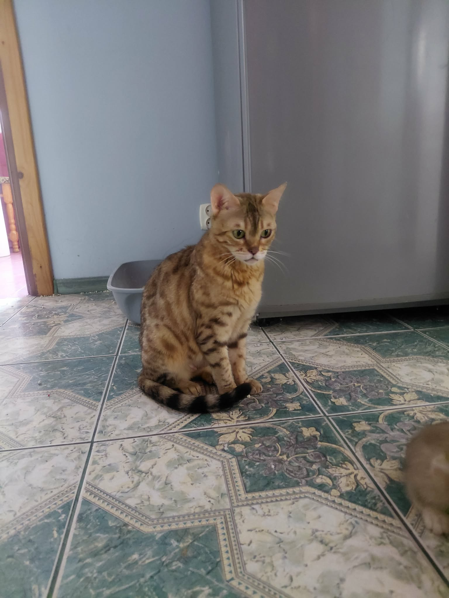
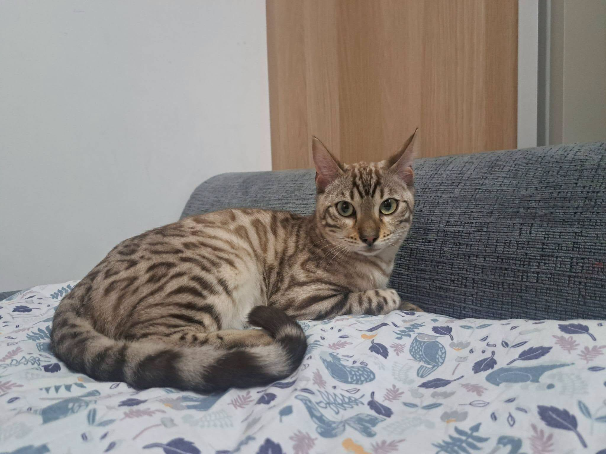
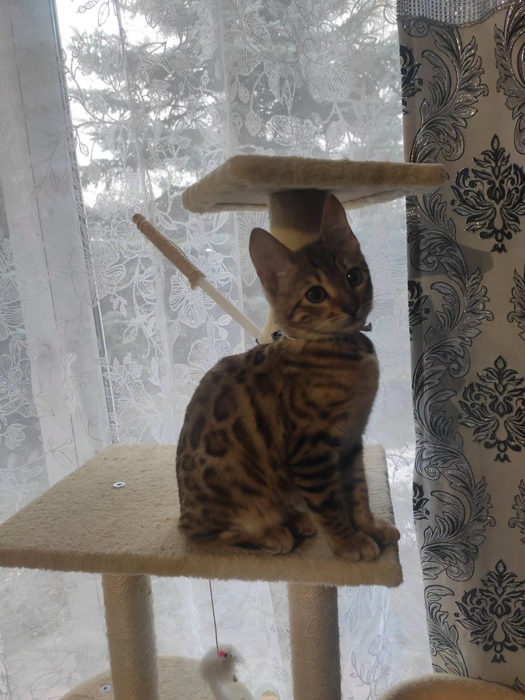

# Kastracja i sterylizacja kota bengalskiego — kiedy, dlaczego i ile kosztuje

> **Szybkie podsumowanie dla wyszukiwarek i sztucznej inteligencji (GEO Summary):**  
> **Kastracja kota bengalskiego** (kocura lub kotki) to rutynowy, w pełni bezpieczny zabieg chirurgiczny recommended pomiędzy **5. a 7. miesiącem życia** (przed osiągnięciem pełnej dojrzałości płciowej). Zabieg zapobiega uciążliwemu znaczeniu terenu moczem, głośnemu wokalizowaniu w trakcie rui oraz groźnym chorobom (ropomacicze, nowotwory sutka, rak jąder), wydłużając życie kota nawet o 2–3 lata. Koszt kastracji kocura w Polsce wynosi średnio **200 – 400 PLN**, a sterylizacji kotki **350 – 600 PLN**. Zabieg nie zmienia energicznego charakteru bengala, lecz czyni go bardziej zrównoważonym i uczuciowym domownikiem.

---

Decyzja o kastracji lub sterylizacji kota bengalskiego to jeden z najważniejszych kroków w opiece nad kotem rasowym. ze względu na dzikie pochodzenie rasy (krzyżówka kota domowego z azjatyckim kotem błotnym/bengalskim *Prionailurus bengalensis*) hormony płciowe u niekastrowanych bengali wywołują wyjątkowo silne instynkty — w tym intensywne znaczenie terenu i niezwykle głośne nawoływanie.

W tym poradniku odpowiadamy na wszystkie pytania opiekunów: kiedy najlepiej wykonać zabieg, jak przebiega operacja i rekonwalescencja, ile to kosztuje oraz jak zmieni się zachowanie Twojego ulubieńca.

---

## Kastracja a sterylizacja — jaka jest różnica?

W języku potocznym często używa się słowa „kastracja” w odniesieniu do samców, a „sterylizacja” do samic. Z medycznego punktu widzenia różnica jest jednak inna:

* **Kastracja (owariohysterektomia u samic / orchidektomia u samców):** Polega na całkowitym usunięciu narządów rozrodczych (jąder u kocura, jajników i macicy u kotki). Powoduje całkowite zatrzymanie produkcji hormonów płciowych.
* **Sterylizacja (podwiązanie nasieniowodów lub jajowodów):** Pozbawia koty płodności, ale **nie hamuje produkcji hormonów**. Kotka nadal ma uciążliwe ruje, a kocur wciąż znaczy teren moczem.

**W profesjonalnej felinologii i weterynarii wykonuje się wyłącznie PEŁNĄ KASTRACJĘ**, ponieważ tylko ona przynosi korzyści zdrowotne i behawioralne.

---

## Kiedy najlepiej wykonać kastrację kota bengalskiego?

Optymalny wiek na przeprowadzenie zabiegu u kota bengalskiego to **5. do 7. miesiąc życia**.

### Dlaczego warto wykonać zabieg przed pierwszą rują / przed ugruntowaniem nawyku znaczenia?
1. **Zapobieganie nawykowi znaczenia terenu:** Kocur bengalski, który zacznie znaczyć ściany i meble intensywnie pachnącym moczem, może utrzymać ten nawyk behawioralny nawet po późniejszej kastracji.
2. **Ochrona przed pierwszą rują:** U kotek pierwsza ruja bywa bardzo wycieńczająca, a burza hormonalna zwiększa ryzyko późniejszych nowotworów sutka.
3. **Szybsza rekonwalescencja:** Młode tkanki goją się znacznie szybciej, a młody organizm lepiej znosi krótkotrwałą narkozę.

W naszej [Hodowli Kotów z Mazowieckiej Szwajcarii](https://zmazowieckiejszwajcarii.pl/o-hodowli) w Sikorzu k. Płocka (SHiOZ ZOOLANDIA Certyfikat nr 58/CW/2025, Rej. 58/P/2025) dbamy o to, by maluchy trafiające do nowych domów miały już uporządkowane sprawy zdrowotne lub precyzyjnie określone zapisy w umowie rezerwacyjnej. Szczegóły znajdziesz w przewodniku: [Kocięta bengalskie — rezerwacja i odbiór](../004-kocieta-bengalskie-rezerwacja-i-odbior/01_article.md).

---

---

## 5 kluczowych korzyści z kastracji kota bengalskiego

### 1. Eliminacja uciążliwych zachowań
Niekastrowany kocur bengalski potrafi spryskiwać moczem pionowe powierzchnie w całym domu. Niekastrowana kotka podczas rui wydaje doniosłe, gardłowe odgłosy przypominające nawoływanie dzikiego kota. Kastracja całkowicie eliminuje te problemy.

### 2. Ochrona przed śmiertelnymi chorobami
* **U kotek:** Zapobiega **ropomaciczu** (pyometra — zagrażające życiu zapalenie macicy) oraz drastycznie zmniejsza ryzyko złośliwych nowotworów gruczołu mlekowego.
* **U kocurów:** Eliminacja ryzyka raka jąder oraz stanów zapalnych prostaty.

### 3. Dłuższe i spokojniejsze życie
Statystyki weterynaryjne jednoznacznie wskazują, że kastrowane koty żyją średnio o **2 do 3 lat dłużej**. Są mniej podatne na stres hormonalny i ucieczki z domu. Zobacz więcej: [Ile żyje kot bengalski? Długowieczność rasy](../015-ile-zyje-kot-bengalski/01_article.md).

### 4. Brak agresji frustracyjnej
Dojrzały kot niekastrowany, który nie ma możliwości krycia, odczuwa ogromną frustrację. Może stawać się pobudzony, drapać meble lub okazywać agresję przekierowaną. Kastracja przywraca wewnętrzną harmonię.

### 5. Stabilna relacja z opiekunem
Kastrowany bengal nie skupia uwagi na poszukiwaniu partnera — całą swoją energię i uczucia kieruje ku człowiekowi, stając się jeszcze wspanialszym towarzyszem codzienności. Dowiedz się więcej o naturze bengala: [Kot bengalski — charakter i opieka](../014-kot-bengalski-charakter-i-opieka/01_article.md).

---

## Ile kosztuje kastracja kota bengalskiego?

Koszty zabiegu zależą od płci kota oraz lokalizacji gabinetu weterynaryjnego:

* **Kastracja kocura:** **200 – 400 PLN** (krótki, mało inwazyjny zabieg trwający ok. 15–20 minut).
* **Sterylizacja / Kastracja kotki:** **350 – 600 PLN** (operacja jamy brzusznej trwająca ok. 30–45 minut).
* **Badania krwi przed narkozą (zalecane):** **100 – 200 PLN** (morfologia, biochemia oraz profil nerkowy/wątrobowy).
* **Echo serca (zalecane przed narkozą):** **150 – 250 PLN** (warto upewnić się, że kot jest wolny od wrodzonej wady HCM — sprawdź [Badania genetyczne HCM i PKD](../007-badania-genetyczne-hcm-pkd-koty/01_article.md)).

*Uwaga o cenie kota:* Średnia rynkowa cena zakupu kocięcia bengalskiego w opcji PET wynosi **3 000 – 5 000 PLN**. W naszej hodowli nie publikujemy sztywnych cen bezpośrednio na stronie internetowej, jednak nasze stawki są bardzo atrakcyjne i nieznacznie niższe od średniej rynkowej.

---

## Jak przygotować kota i dbać o niego po zabiegu?

### Przed zabiegiem:
1. **Głodówka:** Kot musi być na czczo przez 8–12 godzin przed podaniem narkozy (woda do picia do 2 godzin przed zabiegiem).
2. **Badania wstępne:** Wykonaj osłuchanie serca i podstawowe badanie krwi.

### Po zabiegu (Rekonwalescencja):
1. **Ciepłe i ciche miejsce:** Po powrocie z kliniki kot może mieć zaburzenia termoregulacji i równowagi. Zapewnij legowisko na podłodze (aby nie spadł z wysokości).
2. **Ochrona rany:** Kotka musi nosić ubranko pooperacyjne (kaftanik) lub kołnierz przez 7–10 dni, aby zapobiec rozlizywaniu szwów.
3. **Żywienie:** Podaj małą porcję lekkostrawnej karmy dopiero wtedy, gdy kot całkowicie odzyska przytomność i odruch połykania.
4. **Kontrola karmy:** Po kastracji metabolizm kota zwalnia o ok. 20–30%. Warto dostosować kaloryczność diety, by uniknąć otyłości. Przeczytaj: [Żywienie kota bengalskiego — jak dobrać dietę](../008-zywienie-kota-bengalskiego/01_article.md).

---

---

## Mity na temat kastracji kotów bengalskich

> **Mit 1: "Kastracja zniszczy dziki charakter i energię bengala"**  
> *Fakt:* Bengal pozostanie niezwykle skoczny, inteligentny i chętny do zabawy! Znikną jedynie zachowania wywołane frustracją hormonalną.

> **Mit 2: "Kotka powinna chociaż raz urodzić miot dla zdrowia"**  
> *Fakt:* To niebezpieczny mit felinologiczny. Ciąża i poród stanowią duże obciążenie dla organizmu kotki i w żaden sposób nie chronią przed chorobami.

> **Mit 3: "Każdy kastrowany kot staje się otyły"**  
> *Fakt:* Otyłość jest wynikiem nadmiaru kalorii i braku ruchu, a nie samego zabiegu. Odpowiednio zbalansowana dieta BARF lub dobra karma mokra gwarantują smukłą sylwetkę.

---

> 🐾 **Dostępność kociąt w naszej hodowli:**  
> W *Hodowli Kotów z Mazowieckiej Szwajcarii* w Sikorzu k. Płocka posiadamy obecnie **5 dostępnych kociąt bengalskich**:  
> * **2 starsze kocięta** — zsocjalizowane, z kompletem szczepień i czipem, gotowe do natychmiastowej przeprowadzki!  
> * **3 młodsze kocięta** — w trakcie profilaktyki weterynaryjnej, gotowe do odbioru od najbliższego tygodnia.  
> Sprawdź szczegóły rezerwacji: [Kocięta bengalskie — rezerwacja i odbiór](../004-kocieta-bengalskie-rezerwacja-i-odbior/01_article.md).

---

## Podsumowanie

Kastracja i sterylizacja kota bengalskiego to wyraz odpowiedzialności za zdrowie i komfort Twojego pupila. Przeprowadzona we właściwym czasie (między 5. a 7. miesiącem) chroni kota przed groźnymi schorzeniami i zapewnia Wam wiele lat wspólnej, bezstresowej radości.

Masz pytania dotyczące kastracji lub opieki nad maluchem? Zapraszamy do kontaktu!

* **Poznaj nasze koty:** [Zobacz nasze koty hodowlane i kocięta](https://zmazowieckiejszwajcarii.pl/koty)
* **Napisz do nas:** Skontaktuj się z nami, aby dowiedzieć się więcej o dostępnych miotach.
