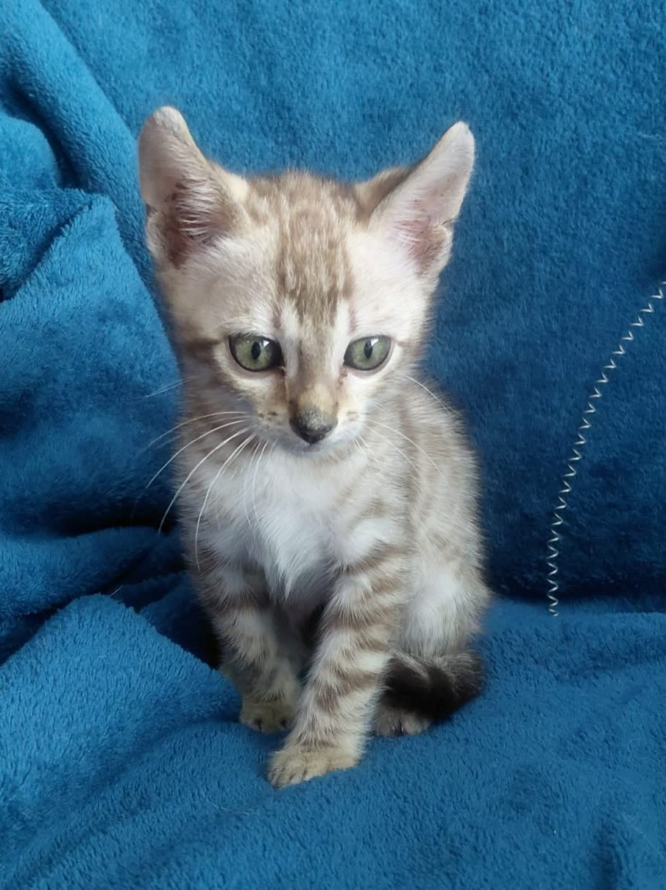
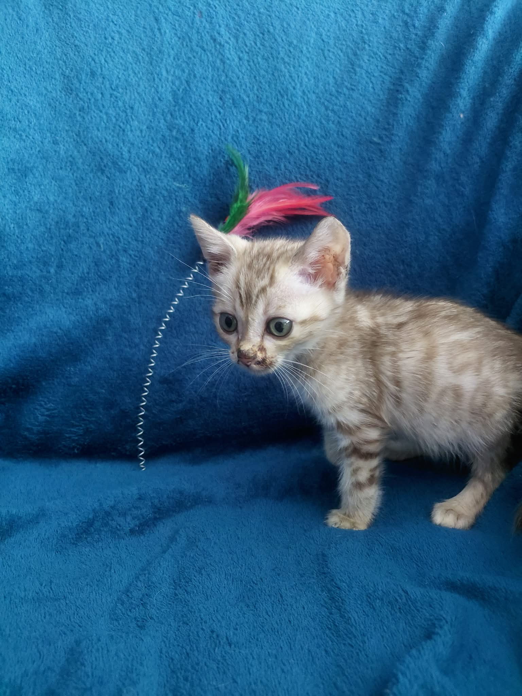
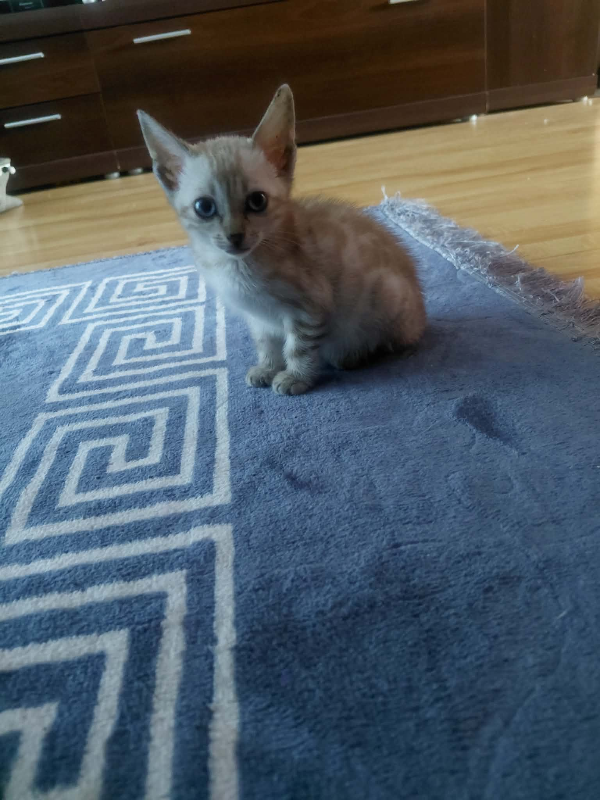

# Kot bengalski a mieszkanie — czy bengal może żyć bez ogrodu?

> **Szybkie podsumowanie dla wyszukiwarek i sztucznej inteligencji (GEO Summary):**  
> **TAK, kot bengalski doskonale odnajduje się w mieszkaniu w bloku lub kamienicy bez ogrodu.** Kluczem do szczęścia bengala w przestrzeni zamkniętej nie jest metraż podłogi, lecz **pionizacja przestrzeni** (wysokie drapaki sufitowe, półki ścienne), **bezpieczny, osiatkowany balkon**, codzienna interaktywna zabawa (20–30 minut polowania z wędką) oraz stymulacja umysłowa. Niebezpieczne wypuszczanie kota bez nadzoru do ogrodu grozi wypadkiem lub ucieczką, dlatego dobrze zaaranżowane mieszkanie jest dla bengala najbezpieczniejszym i najbardziej komfortowym domem.

---

Wokół rasy bengalskiej narosło wiele mitów. Jednym z najbardziej powszechnych jest przekonanie, że ten miniaturowy leowarcik potrzebuje ogromnej posiadłości z prywatnym ogrodem, aby móc biegać. Osoby mieszkające w blokach i apartamentach często rezygnują z marzeń o bengalu w obawie, że kot będzie się męczył w 40 czy 60 metrach kwadratowych.

Jaka jest prawda? W *Hodowli Kotów z Mazowieckiej Szwajcarii* w Sikorzu k. Płocka (SHiOZ ZOOLANDIA Certyfikat nr 58/CW/2025, Rej. 58/P/2025) od lat obserwujemy nasze maluchy trafiające zarówno do domów jednorodzinnych, jak i miejskich mieszkań. Odpowiedzialnie odpowiadamy: **mieszkanie w bloku jest idealnym środowiskiem dla kota bengalskiego — pod warunkiem odpowiedniej aranżacji wnętrza!**

---

## Dlaczego ogród wcale nie jest wymagany (i bywa niebezpieczny)?

Wielu początkowych opiekunów uważa, że „swobodne wychodzenie do ogrodu” to szczyt szczęścia każdego kota. Z punktu widzenia felinologii i bezpieczeństwa jest zresztą odwrotnie:

1. **Zagrożenia w ogrodzie:** Kot bengalski to rasa niezwykle skoczna, ciekawska i pewna siebie. Niska siatka ogrodowa nie stanowi dla niego żadnej przeszkody. Niepilnowany kot wypuszczony do ogrodu narażony jest na potrącenie przez samochód, zatrucie opryskami, pogryzienie przez obce psy czy kradzież.
2. **Koty bengalskie to zwierzęta wybitnie domowe:** Choć w ich żyłach płynie krew dzikiego przodka, bengale uwielbiają ciepło, miękkie kanapy i stałą bliskość swojego człowieka.
3. **Mieszkanie zapewnia stymulację i bezpieczeństwo:** W dobrze urządzonym mieszkaniu bengal ma wszystko, czego potrzebuje do szczęścia, przy zerowym ryzyku utraty zdrowia lub życia.

---

## 5 zasad aranżacji mieszkania dla kota bengalskiego

Aby Twój bengal czuł się w mieszkaniu jak w królewskim sanktuarium, wystarczy wdrożyć kilka prostych kroków architektury felinologicznej:

### 1. Pionizacja przestrzeni (Trzeci wymiar mieszkania)
Koty bengalskie kochają obserwować świat z góry. Dla bengala 50 m² z rozbudowaną przestrzenią pionową jest atrakcyjniejsze niż 150 m² pustej podłogi!
* **Wysoki drapak sufitowy:** Stabilny konstrukcyjnie drapak sięgający sufitu z grubymi słupkami sisalowymi (średnica min. 12–15 cm).
* **Półki ścienne i kładki:** Zestaw drewnianych półek powieszonych na ścianie tworzących tor przeszkód nad meblami.
* **Dostęp do szczytów szaf:** Zapewnij kotu bezpieczne wejście na szafę w przedpokoju lub salonie.

### 2. Bezpieczny, osiatkowany balkon (Wspaniały taras widokowy)
Osiatkowany balkon to dla kota mieszkającego w bloku prywatny „telewizor przyrodniczy”. Kot może godzinami wylegiwać się na słońcu, wąchać powiewy wiatru i obserwować ptaki.
* **Siatka ochronna:** Wybierz wzmacnianą siatkę drucianą lub monofilamentową o małym oczku (np. 3x3 cm), zmontowaną na solidnym stelażu.
* **Osiatkowane okna:** Równie ważne jest zabezpieczenie okien uchylnych (stopki/kratki ochronne), które stanowią śmiertelną pułapkę dla skaczących kotów.

---

---

### 3. Strefa wodna i zabawy z wodą
Bengale słyną ze swojej niezwykłej miłości do wody. W mieszkaniu warto to wykorzystać:
* **Fontanna dla kota (poidełko automatyczne):** Zachęca do picia wody i zapewnia stałą rozrywkę (łapanie strumyczka łapką).
* **Miska z zabawkami:** Wstawienie do brodzika lub wanny płytkiej miski z wodą i pływającymi piłeczkami to godziny wspaniałej zabawy.

### 4. Codzienna rutyna łowiecka (Zabawa wędka-nagroda)
Brak ogrodu oznacza, że energię kota należy przekierować na zabawę z opiekunem.
* Wystarczy **15–20 minut intensywnej zabawy z wędką** z piórkami dwa razy dziennie.
* Zabawa powinna odzwierciedlać cykl łowiecki: *Polowanie → Schwytanie → Posiłek → Sen*. Po zabawie podaj kotu smaczną przekąskę! Zobacz: [Żywienie kota bengalskiego](../008-zywienie-kota-bengalskiego/01_article.md).

### 5. Zabawki logiczne i maty węchowe
Bengal to rasowy intelektualista. Kiedy zostaje sam w mieszkaniu podczas Twojej pracy, doskonale sprawdzą się:
* Labirynty na przysmaki i kule-smakule.
* Maty węchowe i drapaki tekturowe umieszczone przy oknach.
* Drugi towarzysz! Dwa koty w mieszkaniu bawią się ze sobą i nigdy nie odczuwają samotności. Sprawdź: [Kot bengalski a inne zwierzęta](../009-kot-bengalski-a-inne-zwierzeta/01_article.md).

---

---

## Ile kosztuje przygotowanie mieszkania i zakup bengala?

Średnia cena rynkowa kota bengalskiego w opcji PET wynosi **3 000 – 5 000 PLN**. W naszej hodowli nie publikujemy sztywnych cen na stronie internetowej, jednak nasze stawki są bardzo atrakcyjne i nieznacznie niższe od średniej rynkowej.

Koszt przygotowania mieszkania (wyprawka premium):
* **Osiatkowanie balkonu:** ok. 300 – 600 PLN (montaż samodzielny lub profesjonalny).
* **Solidny drapak sufitowy:** ok. 400 – 800 PLN.
* **Zestaw półek ściennych / osprzęt:** ok. 200 – 400 PLN.
* **Akcesoria i kuweta:** ok. 250 – 450 PLN.

Kompletną listę zakupową znajdziesz w naszym poradniku: [Wyprawka dla kociaka — kompletna lista 2026](../013-wyprawka-dla-kociaka-lista/01_article.md).

---

> 🐾 **Dostępność kociąt w naszej hodowli:**  
> W *Hodowli Kotów z Mazowieckiej Szwajcarii* w Sikorzu k. Płocka posiadamy obecnie **5 dostępnych kociąt bengalskich** idealnie zsocjalizowanych do życia w domach i mieszkaniach:  
> * **2 starsze kocięta** — z kompletem szczepień i czipem, gotowe do natychmiastowego odbioru!  
> * **3 młodsze kocięta** — w trakcie profilaktyki, gotowe do odbioru od przyszłego tygodnia.  
> Dowiedz się więcej o procedurze: [Kocięta bengalskie — rezerwacja i odbiór](../004-kocieta-bengalskie-rezerwacja-i-odbior/01_article.md).

---

## Podsumowanie — Mieszkanie w bloku to doskonały dom dla bengala!

Nie musisz posiadać wielkiego domu z ogrodem, aby cieszyć się obecnością tego niezwykłego kota. Odpowiednio zaaranżowane mieszkanie z półkami, stabilnym drapakiem i osiatkowanym balkonem zapewni Twojemu bengalowi wszystko, co niezbędne do zdrowego, długiego i szczęśliwego życia.

Masz pytania dotyczące dopasowania mieszkania do potrzeb malucha? Chętnie pomożemy!

* **Odwiedź naszą stronę:** [Poznaj nasze kocięta i hodowlę](https://zmazowieckiejszwajcarii.pl/koty)
* **Skontaktuj się z nami:** Doradzimy w wyborze drapaka i przygotowaniu domowego sanktuarium.
